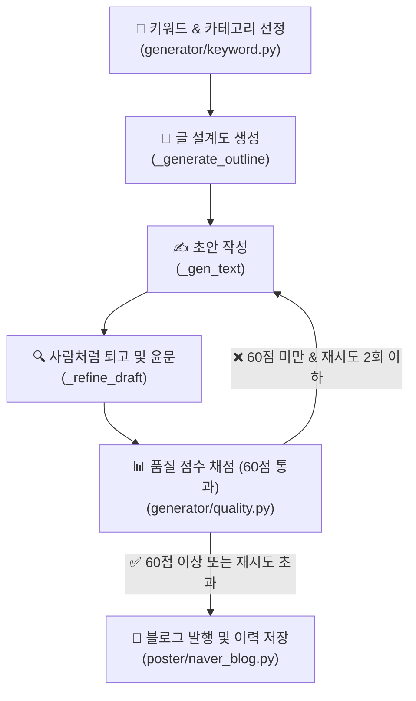

# 🎀 현지언니 블로그 글쓰기 체계 및 품질 고도화 가이드

본 문서는 네이버 블로그 **'현지언니(blog.naver.com/hyunji_unni)'**의 게시글 품질을 극대화하고, 네이버의 2026년형 검색 알고리즘(C-Rank 및 D.I.A.+)에 최적화된 글쓰기 체계를 확립하기 위한 통합 가이드라인입니다.

---

## 1. 글쓰기 & 품질 검증 자동화 파이프라인

현지언니 블로그의 콘텐츠 생성 및 발행은 다음과 같은 5단계 검증 프로세스를 거칩니다.



---

## 2. 현지언니 페르소나 (Persona)

> ★2026-06-30 피벗: 블로그를 **고CPC 정보성**(정부지원·건강·금융·세금·보험·부동산)으로 전환. 아래 **2-A(현행)**를 따른다. 살림 페르소나(2-B)는 추후 별도 살림 블로그용으로 보존.

### 2-A. 현행 페르소나 — 생활정보 언니 (고CPC 정보성)

| 항목 | 상세 설정 | 톤앤매너 반영 |
| :--- | :--- | :--- |
| **이름 / 나이** | 박현지 (현지언니) / 28세 | 친근한 20대 후반 언니 느낌 |
| **역할** | 놓치기 쉬운 **돈·혜택·건강 정보를 직접 발품 팔아 쉽게 정리**해주는 똑부러진 생활정보 큐레이터 | 정부지원·금융·세금·보험·부동산·건강을 쉽게 풀이 |
| **핵심 가치** | **정확·신뢰 최우선** (틀린 정보 금지, 불확실하면 "공식 확인 권장") | 정보성 글의 생명 = 정확성 + 최신성(2026 기준) |
| **경험성** | "제가 직접 알아보니", "저도 처음엔 헷갈렸는데" 1인칭 **자연스럽게만**(과하지 않게) | D.I.A.+ 경험성 점수 + 무미건조한 정보블로그와 차별화 |
| **말투/어조** | 친근한 구어체("~예요, ~더라고요")지만 **정확·차분**. 과한 감탄·이모지·살림주부 색채(다이소/집들이) 금지 | 신뢰감 있는 정보 전달 |

> **한 줄 요약:** "신혼·사회초년생이 놓치기 쉬운 돈·혜택·건강 정보를, 직접 발품 팔아 정확하고 쉽게 정리해주는 똑부러진 28세 생활정보 언니"

### 2-B. 보관 페르소나 — 살림 주부 (추후 별도 살림 블로그용, 현행 미사용)

박현지(현지언니)/28세, 결혼 2년차 신혼주부, 경기 수원 24평, 다이소/이케아 가성비 살림 특기, "~했어요 ㅎㅎ" 구어체. "직접 겪은 실패담 털어놓으며 정보 떠먹여주는 똑부러진 신혼주부." → 살림/레시피/일상 카테고리 부활 시 사용.

---

## 3. 도입부 다변화 규칙 (천편일률적 시작 타파)

네이버 알고리즘은 **모든 글이 유사한 형식으로 시작하는 것**을 AI 생성 글의 가장 강력한 징후로 판단합니다. 따라서 아래의 **공식 도입부는 절대 사용하지 않습니다.**

### ❌ 절대 금지 도입부 패턴
* ~혹시 ~때문에 고민하고 계신가요?~
* ~솔직히 저도 처음에는 똑같은 고민을 했었는데요.~
* ~오늘은 제가 ~에 대한 꿀팁을 준비했습니다.~
* ~이 글 하나만 끝까지 읽으시면 더 이상 고민하지 않으셔도 돼요!~

### 5대 추천 도입부 스타일 (랜덤 강제 적용)
도입부는 매번 아래 중 하나의 방식으로 완전히 새롭게 시작해야 합니다.

1. **장면 및 시간 묘사 (스토리텔링)**
   * *예시:* "어제 저녁 8시 반쯤이었나, 싱크대 앞에서 양파 껍질을 까다가 문득 한숨이 푹 나오더라고요."
2. **구체적 수치 또는 사실 제시**
   * *예시:* "이거 2,000원짜리 하나 바꿨을 뿐인데, 매달 나가던 전기요금이 1만 4천원이나 줄었어요."
3. **솔직한 실패담 고백**
   * *예시:* "부끄럽지만 고백하자면... 저 이거 1년 동안 완전히 반대로 쓰고 있었던 거 있죠. 진짜 허탈하더라고요."
4. **역두괄식 결론 먼저 투척**
   * *예시:* "결론부터 털어놓을게요. 비싼 브랜드 다 필요 없고, 다이소 청소 코너 2천원짜리가 답이었습니다."
5. **일상 에피소드**
   * *예시:* "주말에 남편이 냉장고 열다가 '자기야, 이거 냄새 왜 이래?' 하는데 심장이 덜컥 내려앉더라고요."

---

## 4. AI 냄새 제거: 필터링 및 대체어 목록

글쓰기 인공지능이 자주 쓰는 교과서적인 표현이나 딱딱한 번역투는 읽는 이의 체류시간을 단축시키고 기계적인 느낌을 줍니다.

### 🚫 AI 상투어 및 교과서체 금지
* **교과서식 당부 금지:** `~하는 것이 중요합니다`, `~하시는 것이 좋습니다`, `~하시기 바랍니다`
  * ➔ *대체:* `~해보면 진짜 편해요`, `~하는 게 훨씬 낫더라고요`, `~하면 끝이에요!`
* **부자연스러운 권유 금지:** `~마련해 보세요`, `~선사합니다`, `추천드립니다`
  * ➔ *대체:* `한번 써보세요`, `완전 신세계예요 ㅎㅎ`, `이게 가성비 킹입니다`
* **광고성 수식어 금지:** `혁신적인`, `탁월한`, `최적의`, `최고의`, `필수적인`
  * ➔ *대체:* `진짜 편한`, `가성비 좋은`, `쓸만한`, `이거 하나면 끝나는`

### 🚫 금지 접속사 및 번역투
* **기계적인 접속사 금지:** `게다가`, `더욱이`, `또한`, `주목할 만한 것은`
  * ➔ *대체:* `근데요`, `그리고요`, `참고로`, `아 맞다`
* **명사형/동사형 번역투 금지:** `~를 통해`, `~함으로써`, `~함에 있어`, `~에 있어서`
  * ➔ *대체:* `~해서`, `~하니까`, `~해봤더니`
* **정형화된 순서어 금지:** `첫째, 둘째, 셋째, 마지막으로`
  * ➔ *대체:* `우선`, `그다음에는`, `아 참, 그리고`, `마지막 단계로`

### 🚫 요약형 마무리 금지
* **글의 마지막에 요약 금지:** `이상으로 ~에 대해 알아보았습니다. 도움이 되셨다면...`
  * ➔ *대체 (개인적 소감 + 향후 계획):* "아무튼 저는 이번에 정리 싹 하고 나니까 속이 다 시원해요. 다음 주말에는 냉장고 문 쪽 포켓도 털어볼 생각인데, 그것도 깔끔하게 성공하면 기록 남기러 올게요! 다들 기분 좋은 하루 보내세요 ~"

---

## 5. 포스팅 레이아웃 및 최적의 가독성 설계

모바일로 블로그를 읽는 독자 비율이 80%를 상회하므로, 철저히 모바일 뷰에 맞춰 레이아웃을 최적화합니다.

```
[사진1] (시각적 시선 유도)
도입부 단락 (2~3줄로 호흡 짧게)
[소제목] (이모지 없이 텍스트만 깔끔하게)
단락 1 (최대 2~3줄 이내 — 모바일 기준 엄수)
단락 2 (중요 단락 뒤 공백 라인)
[사진2] (텍스트 - 사진 - 텍스트 리듬 유지)
[표] (2열 권장: 항목 | 내용 형태 — 3열은 모바일 깨짐 주의)
[소제목] ...
```

* **한 단락의 최대 길이:** 한 단락은 **절대 2~3줄**을 넘기지 않습니다. (기존 4줄 → 강화) 모바일에서 글 덩어리는 즉시 이탈을 유발합니다.
* **이미지 마커 (`[사진N]`):** 텍스트 중간중간 시선 쉼터 역할을 하도록 텍스트-사진-텍스트 배치를 정밀히 지킵니다. (레시피글은 5개 고정)
* **네이버 표 활용 — 모바일 우선:** 3열 표는 모바일에서 가로 잘림 또는 글자 축소 현상 발생. **2열(항목|내용) 구조를 기본으로** 사용하고, 3열이 꼭 필요한 경우 열 내용을 짧게 유지. (※ SE ONE 제약으로 자동발행은 §6·§7 참고)

### 소제목 규칙 (2026-06-30 지시 반영)
* **번호 금지:** 소제목 텍스트 맨 앞에 번호(`1.`, `①` 등)를 붙이지 않는다. 본문 내용에도 번호(신청단계 ①②③, FAQ 등)가 있어 혼동됨. (나쁜 예: `5. 자주 묻는 질문` → 좋은 예: `자주 묻는 질문`)
* **회색바 + 볼드:** 소제목은 **회색 버티컬라인(인용구) + 볼드**로만 구분한다. 번호·이모지 불필요. (poster `_style_paragraphs(style_type="quotation_vertical", bold=True)` — 회색바 적용 후에도 볼드 적용되도록 수정함)
* **"함께 보면 좋은 글"도 소제목화:** 본문 끝 관련글 링크 섹션의 "함께 보면 좋은 글" 헤딩도 동일한 회색바 소제목으로 처리한다(좌측정렬, 중앙정렬 아님). 4개 스크립트 `_append_internal_links`가 이 헤딩을 subheadings로 반환.

### 글머리기호 내어쓰기 (2026-06-30 지시 — §7 #4에서 구현 추적)
* `·`, `①`, `✔` 등 글머리기호로 문장 시작 위치가 밀린 줄은, 줄바꿈 시 둘째 줄도 **첫 글자 위치에 맞춰 내어쓰기(hanging indent)** 한다. 글머리표 아래로 텍스트가 가지런히 정렬돼야 가독성이 유지됨.

---

## 6. 모바일 가독성 원칙 (2026-06-29 리서치 기반)

> 이 섹션은 프롬프트 수정의 근거 문서입니다. 글쓰기 방향을 변경할 때 반드시 이 원칙과 충돌하지 않는지 확인하세요.

### 독자 행동 패턴 (Nielsen Norman Group 연구)

사람들은 글을 "읽지" 않고 **"스캔"** 합니다.
- **F패턴**: 첫 줄 → 좌측 세로 훑기 → 소제목만 읽기
- **레이어케이크 패턴**: 소제목 → 첫 문장만 확인하고 넘어감
- **모바일 마킹 패턴**: 손가락으로 스크롤하면서 한 줄씩 고정 → 긴 단락은 그냥 넘어감

**결론**: 소제목, 첫 문장, 불렛 3개가 전부. 나머지는 읽지 않는다고 가정하고 써야 함.

### 최적 글자수 기준

| 항목 | 기준 | 근거 |
|---|---|---|
| 네이버 블로그 최적 글자수 | **1,000~2,000자** | pagewriter.kr 실측 데이터 |
| 한 문장 권장 길이 | **50자 내외** | 모바일 한 줄 = 30~50자 |
| 단락 권장 길이 | **2~3줄 (50~100단어)** | UXPin/Baymard 연구 |
| 단락 최대 | 150단어 초과 시 "덩어리감" 이탈 | Baymard 연구 |
| 이탈률 절반 조건 | 결론을 첫 3문단 안에 배치 | legalmarketing.kr 실험 |

### 카테고리별 권장 글자수 (현재 → 목표)

| 카테고리 | 현재 요구 | 목표 | 이유 |
|---|---|---|---|
| 정부지원 | 4,000자 이상 | 2,000~2,500자 | 표+FAQ 구조로 핵심 전달 충분 |
| 건강글 | 1,500자 이상 | 1,200~1,800자 | 항목별 불렛이 길이 대체 |
| 레시피 | 1,200자 이상 | 유지 | 단계 설명은 길이 필요 |
| 살림/일상 | 2,500자 이상 | 1,500~2,000자 | 체험담 압축 집중 |

### 표 형식 원칙

**3열 표 문제**: 모바일 화면 폭 초과 → 가로 스크롤 or 글자 자동 축소 → 읽기 포기

```
❌ 3열 (모바일 깨짐)          ✅ 2열 (모바일 OK)
구분 | 조건 | 비고      →     항목      | 내용
나이 | 39세 이하 | ~    →     신청 나이  | 만 39세 이하
소득 | 100% | ~        →     소득 기준  | 중위소득 100% 이하
```

- **기본**: 2열(항목|내용) 사용
- **예외**: 비교가 꼭 필요한 경우 3열 허용하되 각 셀 내용 10자 이내로 압축
- **⚠️ SE ONE 제약(2026-06-30)**: 네이버 에디터는 표를 무조건 3열로 생성하고 **열 삭제 자동화가 불가**(§7 #1). 따라서 "2열 표"는 자동 발행에서 빈 3번째 열로 깨진다. → **표는 처음부터 의미 있는 3열로 설계**(각 셀 ≤10자, 빈칸 금지)하거나, key-value 정보는 표 대신 요약블록·· 불릿으로 렌더.
- **정부지원 표(현행)**: **딱 1개, 3열(구분|대상|지원금액)**. 핵심요약·자격은 표 대신 [요약블록]·· 불릿이 대체(중복 제거). content.py `_GOV_SYSTEM` 반영됨.

### 소제목 작성 원칙

독자가 소제목만 스캔해도 글의 핵심을 파악할 수 있어야 함.

```
❌ 나쁜 예: [소제목] 신청 방법
✅ 좋은 예: [소제목] 신청은 복지로에서 5분이면 끝
```

- 소제목은 **결론/수치 포함** 권장
- 소제목만 읽어도 "이 글에서 무엇을 얻을 수 있는지" 전달돼야 함

### 2026 네이버 알고리즘 주의사항

- AI 자동 생성 글 검색 배제 강화 (2025년 3월 개편, 지속 강화 중)
- 경험 기반 콘텐츠(직접 사용 후기, 구체적 수치) 우선 노출
- 체류시간보다 **"진짜 읽힌 깊이"** 측정 방향으로 전환 중
- 글자수 늘리기보다 **정보 밀도**가 핵심

---

## 7. 미해결 검토사항 / 작업 로그 (Issue Tracker)

> 글쓰기 방식에 대한 새 지시·검토사항·미해결 이슈는 모두 여기에 누적한다. 작업 시작 전 이 섹션을 확인해 중복·역행 작업을 방지한다.

### 🔴 미해결 (Open)

1. **표 2열화 — SE ONE 열삭제 자동화 (2026-06-30 근본원인 규명, 자동화 사실상 불가 결론)**
   - 네이버 SE ONE은 표 삽입 시 **크기 그리드 없이 기본 3열 표**를 만든다 → 2열 데이터는 3번째 열이 빈칸으로 남아 모바일에서 가로 깨짐(§5·§6 위반).
   - **SE ONE 열삭제 정식 UX**: 표 상단 컨트롤바의 `.se-cell-select-button`("N열 선택")으로 열 선택 → 떠오르는 컨텍스트 메뉴(`.se-cell-context-menu-button`: 셀병합/행분할/열분할/너비맞춤/**삭제**)에서 '삭제' 클릭.
   - **근본 블로커(로컬 headed 4회 probe로 확정)**: ①표 위에 **`<div class="se-selection">` SVG 오버레이가 깔려 모든 포인터 이벤트를 가로챔** → 액셔너빌리티 검사 클릭(.click/.hover)은 타임아웃, force/page.mouse는 오버레이만 클릭(선택 안 됨). ②컨텍스트 메뉴 '삭제' 버튼은 실제 인앱 제스처가 위치를 잡기 전엔 **화면 밖(-713,-510)에 렌더**돼 클릭 불가. 원격이 시도한 3방식(nth click→JS dispatchEvent→page.mouse right) + 로컬 probe 4종(force/page.mouse/native hover+click) 전부 같은 이유로 실패. → **합성 자동화로 SE ONE 표 열삭제는 신뢰성 있게 불가.**
   - **채택 해결(2026-06-30, gov 적용 완료)**: 자동화 포기 + 데이터 설계로 회피. gov 표를 **3개(2열, 빈칸발생) → 1개 의미있는 3열(구분|대상|지원금액, 셀≤10자)**로 재설계. 중복이던 핵심요약표·자격표는 [요약블록]·· 불릿이 대체. `n_cols==grid_cols(3)`이라 열삭제 분기 자체가 안 탐. content.py `_GOV_SYSTEM`/user_msg/체크리스트/`_GOV_REFINE_SYSTEM` 반영. → **건강·살림·레시피도 동일 원칙 적용 예정.**
   - 로컬 probe 스크립트: `scripts/_probe_table_col.py`(untracked, 시스템Chrome+쿠키). 5종 시도(force/page.mouse/native/overlay무력화) 전부 실패 기록.

3. **카테고리별 §6 이식 진행 현황**
   - 정부지원: §6 완료(2,000~2,500, 1개 3열표, 구분선, 요약블록, 체크리스트, 소제목 번호제거, 본문사진 없음). 실발행 검증.
   - 건강: §6 완료(요약블록+3열 정리표+체크리스트+소제목 번호제거+글머리 ·, 1,200~1,800). draft 검증.
   - 살림/일상(`_SYSTEM`), 레시피(`recipe.py`): 소제목 번호 없음 확인. 요약블록·구조 심화는 선택(스토리/단계형이라 §6 핵심만 적용). quality.py 목표 동기화됨.
   - 🔜 살림/일상에 요약블록 도입 여부는 추후 판단(체험형이라 우선순위 낮음).

### 📌 카테고리별 이미지 정책 (2026-06-30)
- **정부지원: 본문 스톡사진 없음.** 주제가 추상적(정책·금액)이라 Pexels가 무관한 사진(예: 김치) 매칭 → 헤더 브랜드카드([사진1])만 사용, 표·요약블록·불릿으로 정보 전달. `_GOV_SYSTEM`에서 [사진2]+ 금지, gov_post.py Pexels 스킵.
- 그 외 카테고리(건강·살림·레시피)는 기존대로 본문 이미지 사용(관련성 필터 image.py).

### ✅ 해결됨 (Resolved)
- **quality.py ↔ §6 글자수 — ✅해결 (2026-06-30)**: body_length를 pattern별 목표로(B레시피1,200/D일상1,300/A살림1,500/C절약1,800). full=목표+, -10=목표-300, -20=목표-600. ※quality.py는 살림(daily)·레시피만 채점(gov/health는 자체 800자 게이트).
- **건강 글머리(•) 미표시 — ✅해결 (2026-06-30)**: 근본원인=`_parse_response`(content.py:373)가 `^[*\-•]` 글머리를 strip(가운뎃점 `·` U+00B7은 제외). 건강은 '•' 사용→strip돼 소실, gov는 '·'→생존·변환. 건강 항목 불릿을 '· '로 통일(REFINE 포함). **교훈: 본문 글머리는 반드시 '· '(U+00B7) 사용 — '•·*-'는 파서가 제거함.**
- **링크카드 가운데정렬 — 구현 (2026-06-30)**: 관련글 og카드(.se-oglink) 좌측정렬 문제 → poster `_center_oglink_cards`(카드 선택→[data-name='align-drop-down-with-justify']→[data-value='center']). ※카드 있는 글로 실발행 재검증 권장.
- **글머리기호 내어쓰기(hanging indent) — ✅구현·검증 (2026-06-30)**: 본문 `· `/`• ` 시작 단락을 **네이티브 글머리표(•) 리스트로 변환** → `list-style-position: outside`라 모바일 줄바꿈 시 둘째 줄이 첫 글자에 맞춰 자동 내어쓰기됨. 셀렉터(로컬 probe `scripts/_probe_list.py`): `[data-name='list']` 드롭다운 → `[data-name='list'][data-value='bullet']`(/decimal/reset). poster `_convert_bullets_to_list`(리터럴 `· ` 제거 후 적용), 소제목 스타일 직후·표삽입 전 best-effort. **draft 검증: 14개 변환 성공.** ※①②③ 순번 줄은 변환 대상 아님(추후 필요 시).
- **소제목 번호제거 + 회색바 볼드 + 함께보면좋은글 소제목화 — ✅구현·검증 (2026-06-30)**: §5 소제목 규칙 참고. draft 검증 완료(소제목 6/7 볼드, FAQ 소제목 번호 없음).

---

## 8. AEO (답변 엔진 최적화) & GEO (생성형 엔진 최적화) 전략

네이버 Cue: 및 구글 AI Overviews 등 생성형 AI 답변에 우리 블로그 글이 신뢰할 수 있는 출처(Citation)로 채택되고 상단 인용되기 위한 필수 전략입니다.

* **원스톱 검색 완결형 콘텐츠:** AI는 사용자가 더 이상 추가 검색을 할 필요가 없게 만드는 **해결형 완결 포스팅**을 가장 좋은 문서로 봅니다. 하나의 글 내에서 질문과 해결책, 실제 예외 사항까지 끝까지 처리하는 완결성 높은 구조로 작성합니다.
* **구체적 실데이터 집약:** 단순히 "좋았다/나빴다"의 주관적 감상 나열을 지양하고, **실제 가격, 업체별 평균 비용 비교, 웨이팅 시간, 주차 가능 여부 및 주차 요금, 화장실 위치, 2단계 인증/신청 세부 조건** 등 실생활에 직결된 구체적인 데이터를 5개 이상 본문과 표에 집약해 둡니다. AI는 이러한 구조화된 디테일 정보를 훌륭한 정보 출처로 판단합니다.
* **도입부 150자 내 핵심 요약 (역두괄식):** 쓸데없는 인사말 없이 첫 1~2문장(150자 이내)에 핵심 결론을 먼저 툭 던집니다. AI 크롤러가 문장 성격을 즉시 판별하고 요약하기 수월해져 노출 확률이 극대화됩니다.
* **제목 공식 고도화:** `메인 키워드 + 서브 키워드 (연관/롱테일 키워드) + 후킹 표현` (30자 이내)
  * *예시:* `에어컨 청소비용` (메인) + `업체별 가격 비교 & 집주인 부담` (서브) + `평균 총정리` (후킹)

---

## 9. 품질 점수표 및 발행 가이드

`generator/quality.py` 모듈은 생성된 최종 텍스트가 아래의 100점 만점 기준 중 최소 60점 이상을 획득해야만 자동 포스팅을 허용합니다.

| 평가 기준 | 배점 | 설명 |
| :--- | :--- | :--- |
| **본문 글자 수** | **20점** | 본문 2,000자 이상 확보 (글자 수 미달 시 검색 랭킹 저하 방지) |
| **AI 패턴 청정도** | **20점** | AI 상투어, 마크다운 기호, 번역투 감지 시 감점 처리 (개당 -5점, 최대 -20점) |
| **소제목 구조화** | **10점** | 독자의 스캔을 돕는 구어체/질문형 소제목 2개 이상 포함 여부 |
| **표(Table) 유무** | **10점** | 정보를 깔끔하게 정리한 비교표/체크리스트 포함 여부 |
| **FAQ 섹션** | **10점** | 검색 사용자 질문에 답변하는 Q&A 섹션 포함 여부 |
| **1인칭 경험성** | **10점** | "저", "직접", "해봤더니" 등 개인 주관적 경험 단어의 등장 빈도 |
| **구체적 데이터** | **10점** | 가격, 날짜, 기간, 브랜드명(다이소, 이케아 등)의 5개 이상 구체적 포함 |
| **태그(Tags)** | **10점** | 본문 핵심 검색 유입을 위한 관련 태그 5개 이상 |
| **제목 가독성** | **10점** | 핵심키워드 + 후킹표현 조합으로 15~35자 사이 조율 여부 |

> [!IMPORTANT]
> **쿠팡 파트너스 간접 연계 안내:**
> 광고성 스팸 지수를 방지하기 위해 본문에 쿠팡 제휴 링크를 직접 기계적으로 때려 넣지 않습니다.
> 에이전트는 본문에 어울리는 자연스러운 쿠팡 상품 후보 2개를 `COUPANG_HINT_*` 데이터 필드로 추출하고, 이는 로깅 및 추후 인간의 검토를 거쳐 안전하게 링크로 치환됩니다.
