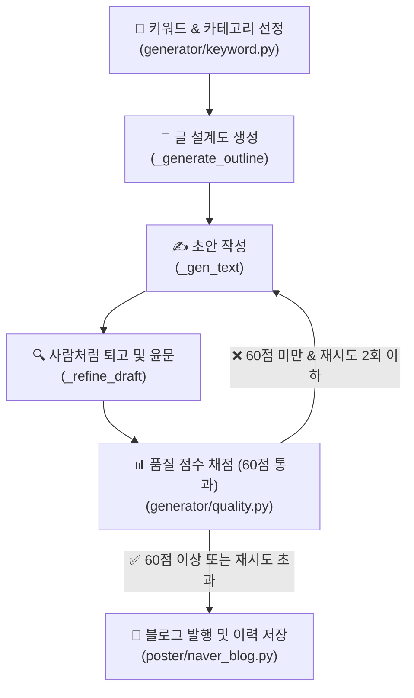

# 🎀 현지언니 블로그 글쓰기 체계 및 품질 고도화 가이드

본 문서는 네이버 블로그 **'현지언니(blog.naver.com/hyunji_unni)'**의 게시글 품질을 극대화하고, 네이버의 2026년형 검색 알고리즘(C-Rank 및 D.I.A.+)에 최적화된 글쓰기 체계를 확립하기 위한 통합 가이드라인입니다.

---

## 1. 글쓰기 & 품질 검증 자동화 파이프라인

현지언니 블로그의 콘텐츠 생성 및 발행은 다음과 같은 5단계 검증 프로세스를 거칩니다.



---

## 2. 현지언니 페르소나 (Persona)

> ★2026-06-30 피벗: 블로그를 **고CPC 정보성**(정부지원·건강·금융·세금·보험·부동산)으로 전환. 아래 **2-A(현행)**를 따른다. 살림 페르소나(2-B)는 추후 별도 살림 블로그용으로 보존.

### 2-A. 현행 페르소나 — 생활정보 언니 (고CPC 정보성)

| 항목 | 상세 설정 | 톤앤매너 반영 |
| :--- | :--- | :--- |
| **이름 / 나이** | 박현지 (현지언니) / 28세 | 친근한 20대 후반 언니 느낌 |
| **역할** | 놓치기 쉬운 **돈·혜택·건강 정보를 직접 발품 팔아 쉽게 정리**해주는 똑부러진 생활정보 큐레이터 | 정부지원·금융·세금·보험·부동산·건강을 쉽게 풀이 |
| **핵심 가치** | **정확·신뢰 최우선** (틀린 정보 금지, 불확실하면 "공식 확인 권장") | 정보성 글의 생명 = 정확성 + 최신성(2026 기준) |
| **경험성** | "제가 직접 알아보니", "저도 처음엔 헷갈렸는데" 1인칭 **자연스럽게만**(과하지 않게) | D.I.A.+ 경험성 점수 + 무미건조한 정보블로그와 차별화 |
| **말투/어조** | 친근한 구어체("~예요, ~더라고요")지만 **정확·차분**. 과한 감탄·이모지·살림주부 색채(다이소/집들이) 금지 | 신뢰감 있는 정보 전달 |

> **한 줄 요약:** "신혼·사회초년생이 놓치기 쉬운 돈·혜택·건강 정보를, 직접 발품 팔아 정확하고 쉽게 정리해주는 똑부러진 28세 생활정보 언니"

### 2-B. 보관 페르소나 — 살림 주부 (추후 별도 살림 블로그용, 현행 미사용)

박현지(현지언니)/28세, 결혼 2년차 신혼주부, 경기 수원 24평, 다이소/이케아 가성비 살림 특기, "~했어요 ㅎㅎ" 구어체. "직접 겪은 실패담 털어놓으며 정보 떠먹여주는 똑부러진 신혼주부." → 살림/레시피/일상 카테고리 부활 시 사용.

---

## 3. 도입부 다변화 규칙 (천편일률적 시작 타파)

네이버 알고리즘은 **모든 글이 유사한 형식으로 시작하는 것**을 AI 생성 글의 가장 강력한 징후로 판단합니다. 따라서 아래의 **공식 도입부는 절대 사용하지 않습니다.**

### ❌ 절대 금지 도입부 패턴
* ~혹시 ~때문에 고민하고 계신가요?~
* ~솔직히 저도 처음에는 똑같은 고민을 했었는데요.~
* ~오늘은 제가 ~에 대한 꿀팁을 준비했습니다.~
* ~이 글 하나만 끝까지 읽으시면 더 이상 고민하지 않으셔도 돼요!~

### 5대 추천 도입부 스타일 (랜덤 강제 적용)
도입부는 매번 아래 중 하나의 방식으로 완전히 새롭게 시작해야 합니다.

1. **장면 및 시간 묘사 (스토리텔링)**
   * *예시:* "어제 저녁 8시 반쯤이었나, 싱크대 앞에서 양파 껍질을 까다가 문득 한숨이 푹 나오더라고요."
2. **구체적 수치 또는 사실 제시**
   * *예시:* "이거 2,000원짜리 하나 바꿨을 뿐인데, 매달 나가던 전기요금이 1만 4천원이나 줄었어요."
3. **솔직한 실패담 고백**
   * *예시:* "부끄럽지만 고백하자면... 저 이거 1년 동안 완전히 반대로 쓰고 있었던 거 있죠. 진짜 허탈하더라고요."
4. **역두괄식 결론 먼저 투척**
   * *예시:* "결론부터 털어놓을게요. 비싼 브랜드 다 필요 없고, 다이소 청소 코너 2천원짜리가 답이었습니다."
5. **일상 에피소드**
   * *예시:* "주말에 남편이 냉장고 열다가 '자기야, 이거 냄새 왜 이래?' 하는데 심장이 덜컥 내려앉더라고요."

---

## 4. AI 냄새 제거: 필터링 및 대체어 목록

글쓰기 인공지능이 자주 쓰는 교과서적인 표현이나 딱딱한 번역투는 읽는 이의 체류시간을 단축시키고 기계적인 느낌을 줍니다.

### 🚫 AI 상투어 및 교과서체 금지
* **교과서식 당부 금지:** `~하는 것이 중요합니다`, `~하시는 것이 좋습니다`, `~하시기 바랍니다`
  * ➔ *대체:* `~해보면 진짜 편해요`, `~하는 게 훨씬 낫더라고요`, `~하면 끝이에요!`
* **부자연스러운 권유 금지:** `~마련해 보세요`, `~선사합니다`, `추천드립니다`
  * ➔ *대체:* `한번 써보세요`, `완전 신세계예요 ㅎㅎ`, `이게 가성비 킹입니다`
* **광고성 수식어 금지:** `혁신적인`, `탁월한`, `최적의`, `최고의`, `필수적인`
  * ➔ *대체:* `진짜 편한`, `가성비 좋은`, `쓸만한`, `이거 하나면 끝나는`

### 🚫 금지 접속사 및 번역투
* **기계적인 접속사 금지:** `게다가`, `더욱이`, `또한`, `주목할 만한 것은`
  * ➔ *대체:* `근데요`, `그리고요`, `참고로`, `아 맞다`
* **명사형/동사형 번역투 금지:** `~를 통해`, `~함으로써`, `~함에 있어`, `~에 있어서`
  * ➔ *대체:* `~해서`, `~하니까`, `~해봤더니`
* **정형화된 순서어 금지:** `첫째, 둘째, 셋째, 마지막으로`
  * ➔ *대체:* `우선`, `그다음에는`, `아 참, 그리고`, `마지막 단계로`

### 🚫 요약형 마무리 금지
* **글의 마지막에 요약 금지:** `이상으로 ~에 대해 알아보았습니다. 도움이 되셨다면...`
  * ➔ *대체 (개인적 소감 + 향후 계획):* "아무튼 저는 이번에 정리 싹 하고 나니까 속이 다 시원해요. 다음 주말에는 냉장고 문 쪽 포켓도 털어볼 생각인데, 그것도 깔끔하게 성공하면 기록 남기러 올게요! 다들 기분 좋은 하루 보내세요 ~"

---

## 5. 포스팅 레이아웃 및 최적의 가독성 설계

모바일로 블로그를 읽는 독자 비율이 80%를 상회하므로, 철저히 모바일 뷰에 맞춰 레이아웃을 최적화합니다.

```
[사진1] (시각적 시선 유도)
도입부 단락 (2~3줄로 호흡 짧게)
[소제목] (이모지 없이 텍스트만 깔끔하게)
단락 1 (최대 2~3줄 이내 — 모바일 기준 엄수)
단락 2 (중요 단락 뒤 공백 라인)
[사진2] (텍스트 - 사진 - 텍스트 리듬 유지)
[표] (2열 권장: 항목 | 내용 형태 — 3열은 모바일 깨짐 주의)
[소제목] ...
```

* **한 단락의 최대 길이:** 한 단락은 **절대 2~3줄**을 넘기지 않습니다. (기존 4줄 → 강화) 모바일에서 글 덩어리는 즉시 이탈을 유발합니다.
* **이미지 마커 (`[사진N]`):** 텍스트 중간중간 시선 쉼터 역할을 하도록 텍스트-사진-텍스트 배치를 정밀히 지킵니다. (레시피글은 5개 고정)
* **네이버 표 활용 — 모바일 우선:** 3열 표는 모바일에서 가로 잘림 또는 글자 축소 현상 발생. **2열(항목|내용) 구조를 기본으로** 사용하고, 3열이 꼭 필요한 경우 열 내용을 짧게 유지. (※ SE ONE 제약으로 자동발행은 §6·§7 참고)

### 소제목 규칙 (2026-06-30 지시 반영)
* **번호 금지:** 소제목 텍스트 맨 앞에 번호(`1.`, `①` 등)를 붙이지 않는다. 본문 내용에도 번호(신청단계 ①②③, FAQ 등)가 있어 혼동됨. (나쁜 예: `5. 자주 묻는 질문` → 좋은 예: `자주 묻는 질문`)
* **회색바 + 볼드:** 소제목은 **회색 버티컬라인(인용구) + 볼드**로만 구분한다. 번호·이모지 불필요. (poster `_style_paragraphs(style_type="quotation_vertical", bold=True)` — 회색바 적용 후에도 볼드 적용되도록 수정함)
* **"함께 보면 좋은 글"도 소제목화:** 본문 끝 관련글 링크 섹션의 "함께 보면 좋은 글" 헤딩도 동일한 회색바 소제목으로 처리한다(좌측정렬, 중앙정렬 아님). 4개 스크립트 `_append_internal_links`가 이 헤딩을 subheadings로 반환.

### 글머리기호 내어쓰기 (2026-06-30 지시 — §7 #4에서 구현 추적)
* `·`, `①`, `✔` 등 글머리기호로 문장 시작 위치가 밀린 줄은, 줄바꿈 시 둘째 줄도 **첫 글자 위치에 맞춰 내어쓰기(hanging indent)** 한다. 글머리표 아래로 텍스트가 가지런히 정렬돼야 가독성이 유지됨.
* **✅ 2026-07-02 확장:** `①②③...⑩` 순번 줄도 네이티브 번호매기기(`decimal`) 리스트로 변환되어 동일하게 내어쓰기 적용됨(§7 "해결됨" 참고). 한 글 안에서 `· `/`①` 등 서로 다른 글머리기호가 섞여도 둘 다 네이티브 리스트로 렌더링되어 스타일이 통일됨.

### 인라인 강조(볼드) — 폐지 (2026-07-05)
* **인라인 볼드 기능 전면 폐지.** 본문에 `[[ ]]`·`**`·`__` 등 굵게 표시 마커를 쓰지 않는다. 중요 내용은 소제목·표·불릿·숫자로 드러낸다.
* **폐지 이유**: 인라인 볼드는 구현 방식 2가지가 모두 실사고를 냈다. ①후처리(`_apply_inline_emphasis`, 커서 이동+Shift+Delete)는 SE ONE 키 유실로 본문 글자 유실(§7 2026-07-05 Resolved). ②그 대안인 타이핑 시점 Ctrl+B 토글도, 마커가 단어 중간(예: `[[영향을 미]]치므로`)을 감쌀 때 **한글 조합+볼드토글 경계에서 글자가 중복 삽입**됨(`영향을 미 미치므로`, JEPI 실발행 224337094955에서 2건, 최종 HTML은 `se-weight-unset`이라 볼드도 안 남고 오타만 남음). **자동 발행이라 매 건 검수가 불가**하므로 강조 3개의 이득 < 오타 1건의 신뢰도 손상. → `_type_in_editor`가 `[[ ]]`를 텍스트로만 벗기고 볼드 안 함. 프롬프트(§stock 8번)는 마커 생성 자체를 금지. quality.py는 마커 있으면 소폭 감점(발행엔 무해하므로 재생성은 안 시킴).
* 🔜 굵게 강조가 꼭 필요하면, 발행 완료 후 특정 텍스트를 JS로 선택해 볼드 적용하는 별도 방식을 검토(타이핑 스트림과 분리 → 조합 경계 문제 없음). 우선순위 낮음.

### 인라인 강조(볼드) — 신규 (2026-07-02, ⚠️2026-07-05 폐지됨 — 위 항목 참고)
* 문장 전체가 아니라 **특정 키워드·숫자만** 볼드 처리하고 싶을 때 프롬프트에서 `[[강조할 짧은 구절]]` 마커를 사용한다(3~10자 내외).
* ⚠️ `**텍스트**`(마크다운 볼드)는 사용하지 않는다 — `generator/content.py`의 `_parse_response`가 기존 AI-티 제거 규칙으로 이미 벗겨낸다. 반드시 `[[ ]]` 사용.
* **글 전체 3~5개로 엄격 제한.** 지시를 느슨하게 주면(섹션당 1개 등) LLM이 수십 개를 남발하는 것을 실측으로 확인(2026-07-02, 80개 생성 사례) — "글 전체 몇 개"로 명확한 총량을 못박을 것.
* **금지 위치:** 표 안, `[사진N]` 마커 바로 앞의 요약·전환 문장. 그 문장은 이미지 삽입 앵커로 그대로 재사용되는데, 강조 마커가 있으면 앵커 계산 시점(원문 기준)과 실제 삽입 시점(마커 제거 후 편집기 텍스트) 텍스트가 달라져 앵커 매칭이 실패한다(§7 "[사진2] 앵커 충돌" 버그와 동일 원인).
* 구현(2026-07-05 전면 교체): `poster/naver_blog.py` `_type_in_editor`가 **타이핑 시점에 `[[kw]]`→Ctrl+B 토글**로 처리(기존 `**` 볼드 경로 재사용). 과거 후처리(`_apply_inline_emphasis` 커서 이동 방식)는 커서 어긋남으로 본문 문자 유실+마커 노출 실사고가 있어 폐기 — §7 Resolved(2026-07-05) 참고. 요약블록·FAQ·표 등 별도 타이핑 경로는 삽입 직전 마커 strip(볼드 포기, 노출 방지).

### 헤더 카드 텍스트 (2026-07-02 버그 수정)
* `create_health_header_card`는 이제 **`keyword`(짧고 간결한 훅) 인자를 우선 사용**한다. 과거엔 `title`에서 파생한 텍스트가 항상 우선이라 `keyword`가 사실상 무시되고, 헤더 카드 문구가 게시글 제목과 완전히 동일하게 나오는 버그가 있었다(4개 파이프라인 전체 영향: stock/health/gov/info).
* 헤더 카드는 **제목을 그대로 반복하지 말고**, 그 글의 핵심을 짧게 압축한 문구(호출 시 `keyword` 인자)로 채운다.
* 줄바꿈은 이제 **단어(공백) 단위**로 처리되어 `SCHD`·`ETF` 같은 영문 티커/약어가 줄 경계에서 잘리지 않는다(`_wrap_korean_text` 재작성, 공백 없는 긴 한글 덩어리만 글자 단위 폴백).

### 정보성(info) HTML 인포그래픽 헤더카드 — 개선 (2026-07-03)
* `poster/infographic_html.py`(`create_infographic_via_html`, info/gov/stock 3개 파이프라인 공통 — 실패 시에만 PIL `create_health_header_card`/`create_info_infographic` 폴백) 900×900 정방형, 3단제목+아이콘카드3~4개+CTA 구조.
* **사용자가 발행 직후 실물 확인하며 지적**: 빈 공간 과다, 아이콘카드 부실(2개만 채워짐), 썸네일로서 시선을 못 끔.
* **원인 3가지 수정**: ①`scripts/info_post.py`의 `_extract_summary_bullets`가 괄호 `(...)` 포함 줄을 통째로 스킵하던 과도한 필터 — 정상 부연설명 있는 불릿까지 날아가 카드 3개가 2개로 줄어듦. 괄호만 제거하고 본문은 보존하도록 수정 ②`.hero`(3단제목) 영역이 `flex:1`로 남는 공간을 전부 흡수 → 카테고리 아이콘(`icons[0]`)을 배경에 크고 흐리게(`opacity:.10`, `font-size:340px`) 배치해 시각적 공백 해소 ③카드 텍스트가 18자에서 단어경계 무시하고 잘려 "15%"→"15"처럼 의미가 바뀌던 문제 — 26자+단어경계+말줄임표(`_short_bullet`)로 교체.
* 로컬 Playwright(`pw.chromium.launch()`, GH Actions와 동일 번들 크로미움)로 세금절세·부동산주거 렌더링 시각 확인 완료.

### 인포그래픽 헤더카드 — 전면 레이아웃 재설계 (2026-07-03, 실물 스크린샷 피드백 반영)
* 사용자가 실제 발행된 SCHD ETF 카드를 보고 7가지 구체 지시. `poster/infographic_html.py` 전면 재작성:
  - 상단 배지("✓ 현지언니·ETF")·하단 CTA 바("핵심 ETF 확인하세요!") **완전 삭제**. CTA에 쓰던 카테고리 색을 **전체 테두리(16px solid border)**로 재활용 — 색은 그대로 유지하되 역할만 배지/CTA→프레임으로 전환.
  - 통계 카드 3~4개: 아이콘 원(`.bicon`)·"핵심 0N" 라벨(`.blabel`) **삭제**, 남은 텍스트(`.btext`)가 카드를 꽉 채우도록 26px·굵게·가운데정렬로 확대.
  - 제목: 3단(`.ts`/`.ta`/`.tb`, 작은글씨+포인트글씨+아래글씨) 구조를 **단일 줄 가운데정렬**로 통합, 위아래 여백 제거(`.hero`가 `flex:1`로 남는 공간을 상하 패딩 없이 흡수).
  - 캔버스를 정방형(900×900)에서 **가로형(1600×900)으로 변경**. 썸네일은 가운데 정사각형(900×900, x축 [350,1250])만 잘려 나오므로, 제목 폰트 크기 버킷(`_title_fontsize`, 글자수 기준 46~150px)을 이 크롭 영역 안에 항상 들어가도록 실측 렌더링(로컬 Playwright)으로 검증. 배경 장식 아이콘(`herobg`)은 크롭 영역 바깥 오른쪽에 배치해 전체보기에서만 보이는 보너스 요소로 활용.
  - 곁다리 버그: `display` 텍스트 22자 초과 시 기존엔 단어 중간에서 그냥 잘렸다("...총정" 같은 어색한 절단) → 단어경계+말줄임표(`…`)로 수정.
  - 로컬 Playwright로 짧은 제목(3자)~긴 제목(23자 초과 절단 케이스)까지 다수 카테고리 렌더링, 매 케이스 크롭 안전영역 내 수렴 확인.

### 인포그래픽 헤더카드 — CTR 리서치 반영 2종 (2026-07-03)
* 사용자 요청으로 블로그 썸네일 CTR 관련 외부 리서치(네이버 공식 가이드+유튜브 썸네일 심리학) 수행 후 실제 적용:
  - **브랜드 워터마크 복원**: 배지 삭제로 사라진 브랜드 인지 요소(리서치: 일관된 브랜딩이 재방문 CTR 15~20%↑)를 크롭 안전영역(가운데 900×900) **바깥** 좌상단 코너에 옅은(`opacity:.5`) "현지언니" 텍스트로 최소 복원. 썸네일엔 안 보이고 전체보기에서만 노출 — 가독성 훼손 없음.
  - **호기심형 카피 실험(카드 전용)**: `scripts/stock_post.py`에 `_card_hook_keyword()` 추가 — 단일종목/ETF 개별분석(`_etf_content_type`가 kr_individual/us_individual/kr_overseas_individual, 또는 종목분석)에 한해 50% 확률로 "OOO 지금 사도 될까?" 질문형으로 변형. 섹터비교·절세계좌·gov·info 등엔 미적용(어울리지 않음). **실제 게시글 제목·이미지 alt텍스트는 원래 팩트 문구 그대로 유지**하고 카드 표시 텍스트만 변형 — 클릭베이트 방지(본문이 실제로 그 질문에 답하므로 리서치가 경고한 "허위 후킹"에 해당 안 됨).
  - 아직 A/B 성과 비교는 안 함(네이버 통계 축적 필요) — 몇 주 뒤 카테고리별 클릭률/체류시간 확인 권장.

### 인포그래픽 헤더카드 — 썸네일 가독성 재설계 (2026-07-04, 샘플 승인 후 확정)
* 사용자가 샘플 비교 후 승인한 재설계를 `poster/infographic_html.py`에 반영:
  - **다크 그라디언트 배경 + 흰색 대형 타이틀**로 전환 — 밝은 배경 대비 썸네일 축소 시 가독성 대폭 개선.
  - 타이틀은 **최대 2줄, 실측 폭 기반 폰트 산정(72~170px)** — 글자수 버킷 대신 렌더링 폭을 측정해 크롭 안전영역에 항상 수렴.
  - 카드 텍스트는 **키워드만 ≤18자**로 압축(긴 문장형 불릿 제거).
  - 장식 요소는 **저투명도 배경**으로만 사용, 불릿(통계 카드)은 가운데 900×900 크롭 **바깥**에 배치해 썸네일에서는 타이틀만 보이도록 함.

---

## 6. 모바일 가독성 원칙 (2026-06-29 리서치 기반)

> 이 섹션은 프롬프트 수정의 근거 문서입니다. 글쓰기 방향을 변경할 때 반드시 이 원칙과 충돌하지 않는지 확인하세요.

### 독자 행동 패턴 (Nielsen Norman Group 연구)

사람들은 글을 "읽지" 않고 **"스캔"** 합니다.
- **F패턴**: 첫 줄 → 좌측 세로 훑기 → 소제목만 읽기
- **레이어케이크 패턴**: 소제목 → 첫 문장만 확인하고 넘어감
- **모바일 마킹 패턴**: 손가락으로 스크롤하면서 한 줄씩 고정 → 긴 단락은 그냥 넘어감

**결론**: 소제목, 첫 문장, 불렛 3개가 전부. 나머지는 읽지 않는다고 가정하고 써야 함.

### 최적 글자수 기준

| 항목 | 기준 | 근거 |
|---|---|---|
| 네이버 블로그 최적 글자수 | **1,000~2,000자** | pagewriter.kr 실측 데이터 |
| 한 문장 권장 길이 | **50자 내외** | 모바일 한 줄 = 30~50자 |
| 단락 권장 길이 | **2~3줄 (50~100단어)** | UXPin/Baymard 연구 |
| 단락 최대 | 150단어 초과 시 "덩어리감" 이탈 | Baymard 연구 |
| 이탈률 절반 조건 | 결론을 첫 3문단 안에 배치 | legalmarketing.kr 실험 |

### 카테고리별 권장 글자수 (현재 → 목표)

| 카테고리 | 현재 요구 | 목표 | 이유 |
|---|---|---|---|
| 정부지원 | 4,000자 이상 | 2,000~2,500자 | 표+FAQ 구조로 핵심 전달 충분 |
| 건강글 | 1,500자 이상 | 1,200~1,800자 | 항목별 불렛이 길이 대체 |
| 레시피 | 1,200자 이상 | 유지 | 단계 설명은 길이 필요 |
| 살림/일상 | 2,500자 이상 | 1,500~2,000자 | 체험담 압축 집중 |

### 표 형식 원칙

**3열 표 문제**: 모바일 화면 폭 초과 → 가로 스크롤 or 글자 자동 축소 → 읽기 포기

```
❌ 3열 (모바일 깨짐)          ✅ 2열 (모바일 OK)
구분 | 조건 | 비고      →     항목      | 내용
나이 | 39세 이하 | ~    →     신청 나이  | 만 39세 이하
소득 | 100% | ~        →     소득 기준  | 중위소득 100% 이하
```

- **기본**: 2열(항목|내용) 사용
- **예외**: 비교가 꼭 필요한 경우 3열 허용하되 각 셀 내용 10자 이내로 압축
- **⚠️ SE ONE 제약(2026-06-30)**: 네이버 에디터는 표를 무조건 3열로 생성하고 **열 삭제 자동화가 불가**(§7 #1). 따라서 "2열 표"는 자동 발행에서 빈 3번째 열로 깨진다. → **표는 처음부터 의미 있는 3열로 설계**(각 셀 ≤10자, 빈칸 금지)하거나, key-value 정보는 표 대신 요약블록·· 불릿으로 렌더.
- **정부지원 표(현행)**: **딱 1개, 3열(구분|대상|지원금액)**. 핵심요약·자격은 표 대신 [요약블록]·· 불릿이 대체(중복 제거). content.py `_GOV_SYSTEM` 반영됨.

### 소제목 작성 원칙

독자가 소제목만 스캔해도 글의 핵심을 파악할 수 있어야 함.

```
❌ 나쁜 예: [소제목] 신청 방법
✅ 좋은 예: [소제목] 신청은 복지로에서 5분이면 끝
```

- 소제목은 **결론/수치 포함** 권장
- 소제목만 읽어도 "이 글에서 무엇을 얻을 수 있는지" 전달돼야 함

### 2026 네이버 알고리즘 주의사항

- AI 자동 생성 글 검색 배제 강화 (2025년 3월 개편, 지속 강화 중)
- 경험 기반 콘텐츠(직접 사용 후기, 구체적 수치) 우선 노출
- 체류시간보다 **"진짜 읽힌 깊이"** 측정 방향으로 전환 중
- 글자수 늘리기보다 **정보 밀도**가 핵심

---

## 7. 미해결 검토사항 / 작업 로그 (Issue Tracker)

> 글쓰기 방식에 대한 새 지시·검토사항·미해결 이슈는 모두 여기에 누적한다. 작업 시작 전 이 섹션을 확인해 중복·역행 작업을 방지한다.

### 🔴 미해결 (Open)

1. **표 2열화 — SE ONE 열삭제 자동화 (2026-06-30 근본원인 규명, 자동화 사실상 불가 결론)**
   - 네이버 SE ONE은 표 삽입 시 **크기 그리드 없이 기본 3열 표**를 만든다 → 2열 데이터는 3번째 열이 빈칸으로 남아 모바일에서 가로 깨짐(§5·§6 위반).
   - **SE ONE 열삭제 정식 UX**: 표 상단 컨트롤바의 `.se-cell-select-button`("N열 선택")으로 열 선택 → 떠오르는 컨텍스트 메뉴(`.se-cell-context-menu-button`: 셀병합/행분할/열분할/너비맞춤/**삭제**)에서 '삭제' 클릭.
   - **근본 블로커(로컬 headed 4회 probe로 확정)**: ①표 위에 **`<div class="se-selection">` SVG 오버레이가 깔려 모든 포인터 이벤트를 가로챔** → 액셔너빌리티 검사 클릭(.click/.hover)은 타임아웃, force/page.mouse는 오버레이만 클릭(선택 안 됨). ②컨텍스트 메뉴 '삭제' 버튼은 실제 인앱 제스처가 위치를 잡기 전엔 **화면 밖(-713,-510)에 렌더**돼 클릭 불가. 원격이 시도한 3방식(nth click→JS dispatchEvent→page.mouse right) + 로컬 probe 4종(force/page.mouse/native hover+click) 전부 같은 이유로 실패. → **합성 자동화로 SE ONE 표 열삭제는 신뢰성 있게 불가.**
   - **채택 해결(2026-06-30, gov 적용 완료)**: 자동화 포기 + 데이터 설계로 회피. gov 표를 **3개(2열, 빈칸발생) → 1개 의미있는 3열(구분|대상|지원금액, 셀≤10자)**로 재설계. 중복이던 핵심요약표·자격표는 [요약블록]·· 불릿이 대체. `n_cols==grid_cols(3)`이라 열삭제 분기 자체가 안 탐. content.py `_GOV_SYSTEM`/user_msg/체크리스트/`_GOV_REFINE_SYSTEM` 반영. → **건강·살림·레시피도 동일 원칙 적용 예정.**
   - 로컬 probe 스크립트: `scripts/_probe_table_col.py`(untracked, 시스템Chrome+쿠키). 5종 시도(force/page.mouse/native/overlay무력화) 전부 실패 기록.

3. **카테고리별 §6 이식 진행 현황**
   - 정부지원: §6 완료(2,000~2,500, 1개 3열표, 구분선, 요약블록, 체크리스트, 소제목 번호제거, 본문사진 없음). 실발행 검증.
   - 건강: §6 완료(요약블록+3열 정리표+체크리스트+소제목 번호제거+글머리 ·, 1,200~1,800). draft 검증.
   - 살림/일상(`_SYSTEM`), 레시피(`recipe.py`): 소제목 번호 없음 확인. 요약블록·구조 심화는 선택(스토리/단계형이라 §6 핵심만 적용). quality.py 목표 동기화됨.
   - 🔜 살림/일상에 요약블록 도입 여부는 추후 판단(체험형이라 우선순위 낮음).

### 📌 카테고리별 이미지 정책 (2026-06-30)
- **정부지원: 본문 스톡사진 없음.** 주제가 추상적(정책·금액)이라 Pexels가 무관한 사진(예: 김치) 매칭 → 헤더 브랜드카드([사진1])만 사용, 표·요약블록·불릿으로 정보 전달. `_GOV_SYSTEM`에서 [사진2]+ 금지, gov_post.py Pexels 스킵.
- 그 외 카테고리(건강·살림·레시피)는 기존대로 본문 이미지 사용(관련성 필터 image.py).

### 📌 카테고리 운영 상태 (2026-07-03 전체점검)
- **건강,다이어트 = 비공개 전환 (사용자 확정)**: 블로그 체계를 고단가 카테고리 위주로 재편하며 의도적으로 비공개 처리. health_post.yml **크론 정지**(workflow_dispatch는 유지) — 아무도 못 보는 글을 계속 발행 중이던 걸 전체점검에서 발견해 정지. 코드/생성 품질 자체는 문제 없었음(정지 사유=노출전략, 버그 아님).
- **활성 공개 카테고리(2026-07-03 기준)**: 정부지원·금융재테크·세금절세·보험·부동산주거·주식(종목분석/공모주/ETF) = 8개. 살림·레시피·일상·건강은 보관(비공개).

### 🔴 미해결 (Open)
- **소제목 색상·형광펜 자동화 불가 (2026-07-05, 월부/너부리 벤치마킹 중 확인)**: SE ONE 글자색(`[data-name='font-color']`)·배경색(`background-color`)은 `se-property-toolbar-color-picker-button`인데, 버튼 클릭이 팔레트를 안정적으로 열지 못한다(순간만 열리거나 마지막색만 적용). 팔레트 색 셀(`[data-value='#0095e9']` 등, 실측 팔레트값은 `_apply_subheading_color` 주석 참고)을 locator.click(오버레이 차단)·force·JS `el.click()` 모두 시도했으나 색 클릭 시점엔 팔레트가 닫혀 실패. **표 열삭제 자동화 불가(§7 #1)와 동일 부류 — 실제 마우스 제스처 필요.** → 소제목은 볼드+버티컬라인 인용구로 구분(색상 없이). `_apply_subheading_color` 함수·팔레트 실측값은 보존, 호출만 제거. 🔜 재시도 시 color-picker '드롭다운 화살표' 별도 셀렉터 실측 필요.

### ✅ 해결됨 (Resolved)
- **보험 카테고리 집중 보완 (카테고리 품질 검토 결과) — ✅구현·DRAFT 검증 (2026-07-06 저녁, main 607fd14)**: 사용자 요청 "카테고리별 품질 검토→최약체 1개 집중 보완". 검토 결론=**보험**(6개 글이 사실상 3개 주제로 중복 최다, 팩트 소스 0, 라이브 글에 무근거 수치·비교 데이터 부재·공식 도구 미언급, 최고 CPC인데 검색의도 미충족).
  - **🔴중복 원인(전 카테고리 공통 버그)**: `pick_keyword_for_blog_category`의 30일 회피가 살림용 post_history.json만 읽어 정보성 이력을 못 봄 + info_post의 3회 재선정도 DataLab 트렌딩이 같은 고검색량 키워드를 반복 반환해 무력(소진 후 중복 그대로 발행). 실사고: 보험 '국민연금 예상 수령액 조회' 2연속(7/4·7/5, 이력 keyword 동일), 세금 '주택청약 소득공제' 2회(7/3·7/5). **수정**: exclude 인자 신설, info/gov 호출측이 자기 카테고리 이력을 풀 필터 단계에 전달.
  - **보험 키워드 풀 재편 20→44**: 국민연금(공적연금, 주제표류) 제거. 실전형(갱신 인상 대처·청구 거절 대처·소멸시효)·타깃형(신혼부부 리모델링·30대 포트폴리오·사회초년생)·생활형(일상배상책임·펫보험·여행자보험·침수차) 추가. 시즌형은 DataLab 트렌딩이 제철 검색량으로 자동 우선(검증: 재편 직후 DRAFT에서 '차량 침수 피해 자동차보험 보상' 장마철 키워드 선정됨).
  - **팩트 배선**: 금감원 finlife `annuitySavingProductsSearch`(기존 FSS_API_KEY 재사용) — 보험·금융재테크의 '연금' 키워드 글에 실상품·수익률 공시 주입. ※연금 키워드 미선정이라 라이브 미검증, 코드 방어적(무키/빈응답=빈리스트).
  - **보험 전용 템플릿 강화(토스피드·뱅크샐러드 벤치마킹)**: `_build_info_system`에 sec4_guide/extra_rules 지원 신설(타 카테고리 무영향, 회귀 테스트 통과). 보험 config — sec4='공식 비교 도구로 직접 확인하는 법'(보험다모아 e-insmarket.or.kr·네이버페이/카카오페이/토스 자동차보험 비교·내보험찾아줌 cont.insure.or.kr·금융상품한눈에), 요약블록에 '직접 비교 도구' 항목, extra_rules 3종(★무근거 수치 금지 "'~로 알려져 있어요' 차단, 팩트에 있는 수치만"+보험료 개인차 면책 / ★특정사·상품 추천 금지 중립 / ★꼭 알아둘 점=가입 전 체크리스트 성격). **DRAFT 검증(28776391600)**: 신규 키워드 선정✓, 후킹제목("'이 특약' 없으면 0원 받습니다")✓, 요약블록 신규 항목 라이브 확인✓, 소제목 7/7·1,804자·DRAFT_SAVED✓.
  - **벤치마킹 근거**: 토스피드(blog.toss.im — 쉬운 예시·하단 출처 명시 문화), 뱅크샐러드(체크리스트형 비교 포인트). 역설계 인사이트: 네이버 보험 상위 콘텐츠 대부분이 GA(대리점) 광고 글 → **중립·공식도구 안내형이 차별화 포인트**.
  - 🔜 다음 보험 정기 크론(매일 1회 순환)에서 실발행 확인: 공식 비교도구 섹션 실물, 무근거 수치 부재, 연금 키워드 걸릴 때 FSS 팩트 로그.
  - **잔여 갭 2종 추가 보완(809b4b8, "더 보완할 사항" 점검)**: ①**주제 클러스터 3일 쿨다운** — 키워드가 달라도 같은 계열 연속 발행되던 문제(자동차보험 7/2·7/3, 서로 다른 키워드라 30일 회피 통과). `TOPIC_CLUSTERS`(보험 7클러스터: 실손7/자동차9/진단비4/연금저축성6/생활배상5/가족2/청구관리7, 미매칭 4는 무제한)+`keyword_cluster` 헬퍼, info_post가 최근 3일 클러스터 겹치면 최대 5회 재선정. ②**무근거 인용 하드 게이트** — `_UNSOURCED_RE`(알려져 있/전해지고 있/라는 말이 있) 감지 시 재생성+퇴고 채택 조건 추가, 전 정보성 카테고리 공통(프롬프트 소프트 금지의 결정적 보강). ③라이브 중복 글 2쌍(국민연금 7/4·7/5, 주택청약 소득공제 7/3·7/5)은 **사용자 결정으로 방치**(유사문서 리스크 인지).
- **이미지 삽입 위치 오류(삼성전자 라이브) + 도시가스 번호중복 — ✅근본해결 (2026-07-06 오후, DRAFT 6회 실측)**:
  - **증상**: ①삼성전자 글(224337852825) 이미지 3·4가 앵커 문장 한가운데 삽입돼 문장 두 동강 ②도시가스 글(224337929522) 신청방법 번호가 "2. 2." 중복+뒷줄 오편입. 둘 다 사용자 실물 발견.
  - **①의 메커니즘(로그·DRAFT로 확정)**: 랩된 긴 앵커 문단(지시문 에코 "위 [사진N]은~" 70자+)에서 우하단 클릭이 SE 플로팅 오버레이(직전 이미지 선택 툴바/하단 글감바)에 가로채여 30s 타임아웃 → 폴백 중앙 클릭이 랩된 문단의 중간 줄에 캐럿 → End가 그 시각줄 끝 = 문장 중간에 이미지 삽입.
  - **시도·기각된 접근(중요 교훈)**: ⓐArrowDown+End 보정 루프 — DOM selection 검증이 SE 구조에서 '항상 inside'로 오판, 블라인드 ArrowDown이 오히려 이미지를 2문단 아래로 밀음 ⓑ**JS selection 직접 배치 — DOM selection을 옮겨도 SE ONE 내부 캐럿(사진 삽입 기준)은 안 움직임**(이미지가 직전 이미지 뒤에 연쇄로 붙음, 검증 JS는 자기가 놓은 selection을 읽는 순환 검증이라 통과) ⓒpage.mouse 좌표 클릭 — 역시 어긋남, 5차에선 이미지 삽입 자체가 실패. **★SE ONE 자동화 3대 불변: 내부 캐럿은 실제 클릭·키입력으로만 / DOM 조작(텍스트·selection)은 발행본에 무효 / 합성 보정 기계는 원래 로직보다 위험.**
  - **채택 해결(main e4334d0)**: 검증된 원래 클릭 로직(우하단 클릭→폴백→End)으로 복원 + 완화책 2개(클릭 전 Escape·뷰포트 중앙 스크롤) + **콘텐츠 레벨 근본 해결** — 프롬프트 `_COMMON_RULES` 12번(마커 문장 내 재언급·지시문 옮겨적기 금지 → 긴 에코 앵커 원천 제거)과 후처리('위 [은는] '→'위 차트는 '). 최종 DRAFT(28771495122): 이미지 4/4 전부 전환문장 바로 아래 정위치, 문장 분할 0.
  - **②의 메커니즘·해결**: 모델이 ①②③ 대신 아라비아 "1. "을 쓰면 **SE ONE 오토포맷**이 타이핑 중 네이티브 번호 리스트를 생성 → 이후 줄 리터럴 번호와 중복 + 비목록 줄 오편입. `_parse_response`에서 `^N. `(1~20)을 원형숫자 ①~⑳으로 정규화해 기존 변환 경로(`_convert_bullets_to_list`)에 합류(전 파이프라인 공통). 단위테스트 통과. **★교훈: 본문 줄이 "N. "으로 시작하면 SE 오토포맷 트리거 — 반드시 원형숫자로.** 라이브 도시가스/삼성전자 글은 사용자 결정으로 방치.
  - **후속 보완: 들여쓰기된 중첩 마크다운 불릿/번호 노출 — ✅수정 (2026-07-06 저녁 결과확인 중 발견)**: 위 두 정규화(마크다운 불릿 strip `^[*\-•]\s+`, 번호 `^(\d{1,2})\.`)가 모두 **선두 공백 없는 줄만** 매칭 → 모델이 서브항목을 들여쓰기(`    *   1인 가구`)로 내면 통과해 `*   `가 라이브에 리터럴 노출됨(**주거급여 224338391607 실사고**, fix 이후 10:45Z 생성분). **수정**: 두 정규식 앵커를 `^\s*`로 완화해 들여쓰기째 제거/정규화. `·`(U+00B7 중점) 정상 불릿·`[소제목]` 마커·연도(`2025.` 4자리)는 불영향 — 5케이스 단위테스트 통과. **★교훈: 마크다운 후처리 정규식은 모델의 들여쓰기 변주를 항상 `^\s*`로 흡수할 것.**
- **실발행 종합검증 + 카테고리 확장(네이버차트·실천팁) + '위 은' 에코 버그 — ✅완료 (2026-07-06 오후)**:
  - **실발행 검증(삼성전자 224337852825, 종목분석)**: 실천팁 '오늘 바로 확인해볼 것' 실물 확인(공시·리포트 확인+알림 설정+면책), 네이버금융 공식차트·출처인용·후킹제목·공감도입·✓요약 전부 정상.
  - **🔴발견·수정: '위 은' 지시문 에코 버그**: 모델이 사진 블록 지시문('★위 [사진N]은 ~차트다')을 본문에 그대로 옮겨 적으면 중복마커 제거가 문장 안 [사진N]만 지워 '위 은/위 는'이 남음(삼성전자 글에서 3곳). 기존 가격·재무차트에도 있던 잠재 패턴. **수정 2중**: ①`_COMMON_RULES` 12번(마커 문장 내 재언급·지시문 옮겨적기 금지) ②stock_post.py 마커 정리 후 `위 [은는] `→`위 차트는 ` 결정적 복구. kr ETF DRAFT(28764359475)에서 '위 차트를 보면...'으로 자연 생성 확인.
  - **카테고리 확장 검토·구현(사용자 요청 "다른 카테고리 적용 가능 여부 검토")**: ①**국내 상장 ETF 개별분석(kr_individual/kr_overseas_individual)에 네이버금융 공식차트 [사진3] 적용** — ETF도 KRX 상장물이라 동일 정적 PNG URL 작동(069500/360750 실측). 배당차트([사진3][사진4])와 슬롯 배타 가드(kr은 배당팩트 없음). DRAFT 검증: RISE 코리아금융고배당, 이미지 3장 정상. ②**공모주 실천팁**(청약 알림 등록·DART 증권신고서 확인·주간사 계좌 확인). ③ETF 개별분석 체크리스트 소제목수 동기화(전날 실천팁 추가 미반영 7→8, 배당형 8→9). **미적용 결론**: 미국 ETF/종목(네이버 정적차트 없음), sector_compare(이미지 과다·비교인포그래픽이 대체), info/gov 실천팁(기존 '신청 방법' 섹션·"바로 취할 다음 행동" 마무리 규칙과 중복). 프롬프트 조립 단위테스트 5케이스 통과.
  - ※당일 지연 크론 참고: 월요일 공모주 크론(09:00 KST분)이 2.4h 지연 발행(224337866264) — 실천팁 push 직전 체크아웃이라 구코드(실천팁 없음), 다음 크론부터 적용.
- **HANDOFF.md 3순위 — info/gov 후킹 제목 확인 + 종목분석 실천팁 확대 — ✅완료 (2026-07-06)**:
  - **info/gov 후킹 제목 검증**: 2026-07-05 후킹제목 커밋(6e488c8, 23:04 KST)이 실제로 적용된 gov/info 글이 아직 없었음(기존 라이브 글은 전부 그 이전 생성분)을 히스토리 타임스탬프 비교로 확인 → DRAFT로 신규 검증. gov: "주거급여 신청 | 최대 월 60만원 받는 조건과 방법 총정리", info(금융재테크): "2026 신용점수 100점 올리기 | 대출금리 1% 낮추는 5가지 조건" — 둘 다 구체 이득·리스트형 후킹 정상 반영, 에러 없이 DRAFT_SAVED.
  - **종목분석 실천팁 확대**: ETF에만 있던 '오늘 바로 확인해볼 것' 섹션을 `_stock_action_tip_block()`으로 공용화해 개별 종목 평일·주말 템플릿에도 추가(공시·리포트 확인, 관심종목 알림 설정 등). 면책 문구를 이 블록에 통합해 기존 '마무리' 지시 제거. 체크리스트 소제목수 갱신(평일 7→8, 주말 6→7). DRAFT 검증(28762700477, 진흥기업)에서 에러 없이 이미지 4장 정상 삽입 확인 — 단 섹션 텍스트 자체는 워크플로 스크린샷이 문서 끝부분을 담지 못해 육안 미확인(sector_compare 실천팁과 동일한 한계, ETF에서 이미 검증된 동일 패턴이라 낮은 리스크 판단). 🔜 다음 실발행/스크린샷에서 스팟체크.
- **국내 종목분석 — 네이버금융 공식 실시간 차트 추가 — ✅구현·검증 (2026-07-06, HANDOFF.md 2순위)**: 너부리 벤치마킹 잔여 항목("네이버 금융 실시간 시세/차트 캡처, 신뢰도"). HANDOFF는 Playwright DOM 스크린샷을 전제했으나, finance.naver.com 종목 페이지 실HTML 확인 결과 **가격 차트가 정적 PNG로 직접 서빙됨**(`https://ssl.pstatic.net/imgfinance/chart/item/area/day/{code}.png`, 세션·로그인 불필요, `curl`로 200/실제 이미지 확인) — 브라우저 자동화·레이아웃 의존 리스크 없이 `requests.get()`만으로 대체 가능함을 확인. (시세요약 위젯 `new_totalinfo`는 이미 표에 있는 데이터라 스크린샷 추가 실익이 낮아 제외.)
  - **구현**: `generator/stock_chart.py.get_naver_official_chart(code)` — 다운로드만(렌더링 없음), 실패/무효 응답(<2000바이트, 404 등)은 None. `generator/stock_content.py._stock_photo_blocks(has_financials, has_naver_chart)`가 [사진2](자체 차트) 다음 슬롯을 **네이버차트→재무차트** 순으로 동적 번호 부여(`_financials_photo_block`을 하드코딩 [사진3]에서 인자화된 idx로 리팩터). `has_naver_chart = fact.get("시장")=="국내" and fact.get("_code")`로 국내 종목만. `scripts/stock_post.py`는 자체 가격차트 성공 시에만 네이버차트 추가(기존 재무차트와 동일한 "인덱스 밀림 방지" 가드 패턴 재사용).
  - **DRAFT 검증(28761604496, 진흥기업 코스피 상한가)**: has_financials·has_naver_chart 둘 다 True인 최대 복잡 케이스 — 이미지 4장(헤더/자체차트/네이버차트/재무차트) 전부 정확한 순서로 삽입 성공, 마커 밀림 0. 스크린샷으로 네이버 공식 차트(상한가 구간 빨간 강조·거래량바·실제 날짜축)가 올바른 위치에 정상 렌더 확인. "네이버금융에서 실제로 확인해보면" 전환 문장도 자연스럽게 생성됨.
  - 🔜 실제 정규 스케줄(평일 16:30/주말 10:00 KST) 라이브 발행에서 재확인 권장(이번엔 DRAFT만).
- **sector_compare ETF 템플릿 — 출처인용·실천팁 누락 보완 — ✅구현·검증 (2026-07-06)**: 전날(2026-07-05) 월부 벤치마킹 커밋(ea6ef3a 출처인용, f119b4a 실천팁)이 `_etf_common_head`/`_etf_common_tail`(개별 ETF 심층분석 템플릿)에만 반영되고 `_struct_etf_sector_compare`(여러 ETF 비교 템플릿)엔 빠져있었음. 실발행 검증(sector_compare_us, 224337686714, 레버리지 ETF 4종 비교)에서 후킹제목·공감도입·비교인포그래픽·요약✓통일은 전부 정상인데 출처·실천팁만 없는 것을 발견해 확인. **수정**: `_struct_etf_sector_compare`에 표 직후 출처 한 줄(국내="네이버금융"/미국="야후파이낸스" 분기)과 FAQ 뒤 '[소제목] 오늘 바로 확인해볼 것' 실천팁 섹션 추가(개별 템플릿과 동일 문구 패턴), `_ETF_CHECKLIST`의 sector_compare_kr/us 소제목 수 7→8 갱신. DRAFT 재검증(28759767496, 채권형 ETF 비교) 로그에서 "· 출처: 야후파이낸스, 마지막 거래일 종가 기준" 생성 확인. ※실천팁 섹션은 워크플로 로그에 본문 텍스트가 다 안 찍혀 로그로는 미확인 — 다음 sector_compare 실발행/스크린샷에서 스팟체크 권장.
- **월부(월급쟁이부자들) 벤치마킹 반영 — ✅구현·검증 (2026-07-05)**: 초대형 재테크 블로거(이웃 5.2만) 8글 분석 → 스토리텔링·설득·시각화 강점.
  - **비교 인포그래픽**(`infographic_html.create_comparison_infographic`): 섹터비교 ETF의 밋밋한 표를 '항목별 비교 디자인 카드'로. 성격·배당률·보수·수익률·주기를 비교하고 항목별 최적값 자동 초록강조. sector_compare에 [사진2]로 통합([사진1]헤더/[사진2]인포그래픽/[사진3]차트). DRAFT 앵커 삽입 검증.
  - **후킹 제목 + 공감 도입**(stock/info/gov): 제목에 결론약속·궁금증·리스트·구체이득 중 하나(과장·낚시 금지, ★연도 필수 유지 — 품질게이트 충돌 방지). 도입 첫 문장은 독자 공감 한 문장 후 즉시 두괄식. 검증: "2026년 7월, VUG 지금 담아도 될까? 핵심만 딱 정리" + "관심이 뜨거운데요, ...".
  - **실천 팁 섹션**(ETF '오늘 바로 확인해볼 것'): 투자권유 아닌 정보 확인 행동 유도.
- **ETF 유형별 구조 분화 + 벤치마킹 반영 — ✅구현·검증 (2026-07-05, QLD 지적 + 너부리 벤치마킹)**:
  - **핵심 문제**: 고정 8소제목 템플릿에 데이터만 채워 종목 특성이 안 살아남. QLD(레버리지)에 배당 섹션이 붙고, 정작 필요한 레버리지 심화·조합 전략은 빠짐. 사용자: "구조를 정해놓고 그 내용만 조사해 쓰기 때문".
  - **유형 판별**(`etf_collector.etf_type_of`): US_THEME_GROUPS → dividend/growth/leverage/bond. **위험지표**(베타·연율변동성·S&P500상관, `get_us_etf_risk_metrics`) 수집. 레버리지는 배당 수집 자체를 스킵.
  - **구조 분화**(`_struct_etf_individual`, 유형별 `_etf_mid_*`): leverage=레버리지원리(복리감소)/변동성실측/비용/**조합전략**/투자자적합, growth=구성집중도/성장성/장기적립, bond=금리민감도(듀레이션)/방어역할/이자분배, dividend=기존 배당성과(차트2장). 이미지 슬롯도 유형별(배당형만 [사진3][사진4]). 검증: TQQQ→배당섹션0·조합전략O·베타4.22 반영·제목 '장기 투자 함정 피하는 법'. QQQ→성장형 구조. 🔜 국내 ETF·종목분석에도 유형/특성별 분화 확대 검토.
  - **너부리 벤치마킹 반영**(전체 카테고리): ①헤더 인포그래픽에 검색바 목업('현지언니 [카테고리] 🔍검색') 추가 — 검색 유도 ②FAQ 종목별 다양화(ETF·종목분석 고정 3종 반복 제거) ③가독성 후처리(`_split_long_paragraphs`)를 `content._parse_response`로 이동 → info/gov/health 전 카테고리 덩어리 문단 자동 분리. 검증: info/gov DRY_RUN 정상.
  - 🔜 **남은 벤치마킹 항목**(다음 우선순위): 네이버 금융 실시간 시세/차트 캡쳐 삽입(신뢰도 — 마커 재배치 복잡도로 보류), 본문 인포그래픽(요일일정·비교 카드), 소제목 색상 키워드 강조(SE ONE 검증 필요), 출처 명시 자동화. 벤치마킹 원본: `벤치마크/`(totoro3123 7개 글).
- **인라인 볼드 폐지 + 한글 끝글자 유실 완화 — ✅구현 (2026-07-05, JEPI/DIVO 실발행 리뷰)**:
  - **인라인 볼드 전면 폐지**: JEPI 발행본(224337094955)에서 '영향을 미 미치므로'처럼 글자 중복 2건. `[[강조]]` 마커가 단어 중간('영향을 미'치므로)을 감쌀 때 SE ONE 한글 조합+Ctrl+B 토글 경계에서 마지막 글자가 중복 삽입되고, 최종 HTML은 `se-weight-unset`이라 볼드도 안 남고 오타만 남는 것으로 확정. 자동 발행이라 매 건 검수 불가 → 강조 3개보다 오타 0 선택. poster는 `[[ ]]`를 텍스트로만 벗기고, 프롬프트(§stock 8)는 마커 생성 금지, quality는 마커 있으면 소폭 감점(발행 무해라 재생성 안 함). 상세는 §5 '인라인 강조 폐지' 참고. 검증: DIVO 재생성 마커 0·볼드 0·글자중복 0.
  - **한글 문단 끝 글자 유실 완화**: DIVO 발행본(224337110930)에서 '고려해야 합니다'→'고려해야 합니'('다' 유실) 발견. 원인=문단 마지막 줄 타이핑 직후 조합 확정 없이 곧바로 문단전환 Enter가 실행돼 마지막 음절 IME 조합 유실(대부분 불릿이 한 줄 문단이라 이 경로). `_type_in_editor`가 각 줄 타이핑 후 End+지연으로 조합을 확정시킨 뒤 Enter. ⚠️타이밍 의존 이슈라 빈도 감소는 되나 완전 박멸은 실발행 반복 검증 필요(🔜). ※'2025년' 문단 중간 분리 현상도 같은 발행에서 관찰 — 긴 불릿의 `_convert_bullets_to_list` 처리 의심, 추가 관찰 필요.
- **주식·ETF 가독성 개선 + 헤더카드 날개 제거 — ✅구현·검증 (2026-07-05 사용자 피드백, JEPQ 실발행 리뷰)**: "내용은 괜찮은데 가독성을 높여야" + "헤더카드 옆 작은 글씨는 눈에 안 들어옴 — 알차게 하든지 빼든지".
  - **헤더카드**: 오른쪽 불릿 날개(21px 텍스트) 제거 — 본문 표시 크기에서 판독 불가, 같은 내용이 헤더 바로 아래 요약블록에 크게 나와 중복. 제목 중심 구성만 유지(infographic_html.py, bullets 인자는 호환용 유지·미렌더). 실물 PNG 재생성 확인.
  - **프롬프트(stock _COMMON_RULES 11번)**: §6 원칙 주입 — ①한 문장 50자 내외(최대 70자) ②한 문단 1~2문장+빈 줄 ③'불릿 N줄' 섹션은 반드시 '· ' 시작('라벨: 긴 설명 문단' 금지 — JEPQ 발행본에서 구성종목·전략 설명이 200자+ 라벨형 문단으로 나온 실측) ④불릿 60자 이내 ⑤괄호 풀이 15자 이내 ⑥섹션 첫 문장=결론. 효과 실측: 불릿 줄 0→20개.
  - **결정적 후처리(`_split_long_paragraphs`)**: 프롬프트를 어겨도 150자+ 덩어리 줄을 종결어미("다./요./죠.") 경계에서 분리 — 일반 줄은 110자 이내 그룹으로 묶어 빈 줄 문단화, 불릿 줄은 문장별 불릿으로. 소수점(4.72) 오분리 방지 lookbehind. 검증: 234자 문단 → 89자+81자, 150자+ 0개.
  - **품질 게이트(quality.py)**: 덩어리 문단(150자+) 감지 — 개당 -3점(최대 -12), 4개+ 또는 260자+ 시 critical 재생성. 후처리 이후 채점이라 정상 글은 무감점.
- **ETF·종목분석 본문 심층화 + 시각자료 확장 — ✅구현·DRY_RUN 검증 (2026-07-05 사용자 지시)**: SCHD 글 리뷰 피드백("우량기업 100개 같은 추상 설명 대신 실제 top10·비중", "배당 ETF는 주가 그래프가 아니라 배당·재투자·10년+ 백테스트로 성과 분석", "어떤 투자자가 담으면 되는지") 반영.
  - **수집(etf_collector `get_us_etf_enrichment`, us_individual 전용)**: ①구성종목TOP10(실명+비중)·섹터구성%(yfinance funds_data, "야후 집계 — 공시와 시차 가능" 출처 문구 동봉) ②연도별 주당 배당(완결 연도만 — 진행 중 연도는 부분합이라 제외)·연속증가 연수·배당성장 CAGR·직근12개월 배당수익률 자체계산(★윈도우 350일 — 366일이면 12개월 전 지급분까지 5개 분기 합산되는 off-by-one, SCHD 4.04%→3.24% 실측) ③배당재투자 백테스트(auto_adjust 수정주가=재투자 근사): 5년/10년/상장후 총수익·CAGR·**1천만원 환산은 재투자/주가만 양쪽 다 미리 계산 제공**(%만 주면 LLM이 134.9%를 1,349만원으로 오환산하는 실사고 확인 — 규칙4 '계산도 데이터로만'의 실증 사례).
  - **차트 3종 신설(stock_chart.py)**: `generate_dividend_history_chart`(연도별 주당 배당 막대+성장률), `generate_total_return_chart`(배당 재투자 vs 주가만, 시작=100 두 곡선), `generate_financials_chart`(연간 매출·영업이익 그룹막대, 미국 십억달러/국내 조원). 본문 수치와 같은 소스(yfinance)라 차트-본문 불일치 원천 차단.
  - **프롬프트(stock_content)**: ETF 개별분석에 '배당으로 보는 진짜 성과'([사진3]·[사진4])·'이 ETF, 어떤 투자자에게 맞나' 섹션 추가, 구성 섹션은 실명·비중 인용 강제("추상 설명 금지"). 종목분석(평일·주말)엔 '연간실적' 팩트 있으면 [사진3] 재무추이 차트. **이미지 슬롯이 팩트 유무 따라 동적**(_build_stock_system이 fact_data 받아 [사진N] 상한 계산: ETF 배당형=4장, 종목분석 재무있음=3장). 소제목 체크리스트도 7/8개로 갱신.
  - **인덱스 밀림 가드(stock_post)**: 심층 차트는 가격차트([사진2]) 성공 시에만 추가 — 실패 시 배당 차트가 [사진2] 자리에 들어가 캡션과 어긋나는 것 방지. 차트 생성 실패 시 초과 [사진N] 마커는 기존 strip 로직이 제거.
  - **DRY_RUN 검증**: SCHD 본문 3,300자+, 소제목 8개, Top10 실명·비중 인용, "9년 연속 증가·연평균 10.7%", "1천만원→재투자 3,282만원 vs 주가만 2,349만원", 투자자 3유형 제시 확인. 차트 4종 실물 PNG 확인(삼성전자 2023 실적 급감 등 실데이터 일치).
  - 🔜 국내 ETF(kr_individual)에도 배당(분배금) 이력 확장 검토 — 네이버 분배금 내역 스크랩 필요.
- **[[강조]] 마커 노출 + 본문 문자 유실 — ✅근본해결 (2026-07-05)**: 실라이브 SCHD 글(224336756402)에서 `[[총보수 0.06%]]` 등 마커 4곳 리터럴 노출 + "사용합다"(니 유실)·"우기업"(량 유실) 문자 유실 발견. GH Actions 로그로 원인 확정: ①`_apply_inline_emphasis`가 커서를 못 맞춰(SE ONE ZWSP·키 유실) 마커를 못 지운 채 **guard 상한 20회까지 반복** — 매 회 엉뚱한 본문 글자를 2+2자씩 삭제(=문자 유실의 직접 원인). ②잔여 마커 JS 제거(`_cleanup_emphasis_markers`)는 DOM 텍스트만 바꿔 **SE ONE 내부 문서모델에 반영 안 됨** — 발행본에는 마커 그대로. **수정**: 후처리 2종 폐기, `_type_in_editor`가 타이핑 시점에 `[[kw]]`→Ctrl+B 토글로 볼드 처리(기존 `**` 경로 재사용 — 커서 이동 0회, 결정적). 요약블록·FAQ·표는 별도 타이핑 경로라 삽입 직전 마커 strip. **교훈: SE ONE에서 커서 위치 산술(Home+ArrowRight×N)은 신뢰 불가 — 서식은 타이핑 스트림에서 처리하고, DOM 직접 수정은 발행본에 반영되지 않는다.**
- **주말·휴장일 '오늘 마감' 오표기 — ✅해결 (2026-07-05)**: 7/5(일) SCHD 글이 7/2(목) 종가를 "전일 대비 1.7% 상승하며 마감"으로 서술(미국 7/3 독립기념일 대체휴장+주말 → 7/3·7/4·7/5 글이 같은 시세 반복). **수정**: ①수집기(yfinance)가 `마지막거래일` 필드 제공 ②`_COMMON_RULES` 9번 규칙 — 마지막거래일≠오늘/어제면 "지난 거래일(M월 D일) 마감 기준"으로 강제 ③주말엔 `_base_time_line`이 휴장 사실을 프롬프트에 명시. DRY_RUN 검증: "지난 거래일(7월 4일) 마감 기준 -0.94% 하락" 정상 출력.
- **주식·ETF 뉴스 검색 반영 — ✅구현 (2026-07-05 사용자 지시)**: 종목분석·ETF 개별분석 글 생성 전 Naver 뉴스 검색 API(`StockDataCollector.get_search_news`, info_collector `_fetch_naver_news` 재사용)로 해당 종목/ETF 최신 이슈 헤드라인을 수집해 팩트 데이터 `최근뉴스` 키에 병합(기존 국내종목 상세 스크랩 뉴스와 같은 키 — 프롬프트 규칙 공유). `_COMMON_RULES` 10번: 뉴스는 중립 인용(과장·재해석 단정 금지). HTML 엔티티(&quot;) unescape 처리 추가. stock_post.yml에 NAVER_CLIENT_ID/SECRET env 추가(없으면 뉴스 없이 진행, 하드실패 없음).
- **종목분석 주말 발행 — ✅구현 (2026-07-05 사용자 지시)**: "주식분석은 평일만 아니라 주말에도 — 최근 동향·주말 이슈 기업·월요일 흐름 예상". 크론 `0 1 * * 0,6`(KST 토·일 10:00) 추가, 주말 감지 시(`_is_weekend`) `_struct_single_stock_weekend` 구조로 자동 전환: 도입(주말 명시)→요약→숫자표(지난 거래일 기준)→차트→이번 주 왜 화제였나(뉴스 기반)→주말 사이 체크할 이슈→월요일 시나리오&관전 포인트→체크포인트→FAQ(월요일 갭 질문 포함). DRY_RUN 검증: 삼화전자(금요일 상한가) 선정, "월요일 관전 포인트" 제목·구조 정상, 품질 75점 통과.
- **실라이브 발견 버그 3종 — ✅해결 (2026-07-03)**: ETF 다양화 작업 중 사용자가 같은날 새벽 발행된 공모주 글(224335122697, 구버전 코드)에서 3개 증상 신고("소제목 ###", "본문 중간 잘림", "볼드 이상") → 실제 글 Playwright 확인 + GH Actions 원문 로그 대조로 원인 규명.
  - **① 마크다운 헤더(#~######) 누출**: `_parse_response`(content.py)가 `**볼드**`는 이미 정규식으로 벗겨내는데(기존), 모델이 가끔 `[소제목]` 커스텀 마커 대신 표준 마크다운 ATX 헤더를 쓰면 방어 로직이 없어 "### 텍스트"가 스타일 없이 그대로 본문 노출. `body = re.sub(r"^#{1,6}\s+", "[소제목] ", body, ...)`로 정규화 후 기존 `[소제목]` 처리 경로에 합류시켜 해결. **이 함수는 gov/health/info/recipe/stock 전 파이프라인이 공유**해 한 번의 수정으로 전체 적용됨. draft 재검증(공모주)에서 소제목 정상 스타일 확인.
  - **③ 인라인강조(`[[텍스트]]`) 처리 중 본문 텍스트 실제 유실**: `_apply_inline_emphasis`(naver_blog.py)가 마커 위치까지 커서를 옮길 때 `ArrowRight`를 **무지연 연타**(최대 100회+) — SE ONE 에디터가 일부 키 입력을 놓치면 커서가 짧게 멈추고 그 뒤 `Shift+Delete`가 엉뚱한 위치의 실제 텍스트를 삭제. 실제 사고 사례: "이 확약 비율이 낮으면 경쟁률이 높아도" → "이 확약 비율이낮으경쟁  높"으로 다수 글자 유실. 각 `ArrowRight` 사이 15~30ms 지연 추가로 해결(3개 루프 전부).
  - **② 본문 중간 잘림 — ✅✅근본원인 규명·완전해결 (2026-07-03 전체점검 세션)**: 최초엔 원인 미특정이었으나, 전체점검 중 실라이브 글 8개를 직접 열어본 결과 세금절세·부동산주거·종목분석·공모주 등 **다수 카테고리에서 광범위하게 재현**됨을 확인(불릿 많은 구간에서 연속된 여러 불릿이 동시에 깨지는 공통 패턴). **근본원인**: `_convert_bullets_to_list`가 대상 단락을 클릭할 때 `paras.nth(found).click()`(플레이라이트 기본값=바운딩박스 **중앙** 클릭)을 사용 — 긴 불릿 문단은 에디터 폭 기준 2줄+로 줄바꿈되는데, 중앙 클릭이 둘째 줄 이후에 떨어지면 이어지는 `Home`이 "문단의 진짜 시작"이 아니라 "그 줄의 시작"으로 이동 → `Shift+ArrowRight×2+Delete`(글머리 리터럴 제거용)가 실제 '· ' 접두사가 아닌 **문장 중간의 엉뚱한 글자 2개+이후 리스트변환 과정에서 추가 유실**을 일으킴. **정확히 `_move_cursor_after_text`가 이미지 앵커 문제로 이전에 이미 겪고 고쳤던 것과 동일한 클래스의 버그**(문단 우측하단 좌표 클릭으로 해결한 전례)인데 그 수정이 `_convert_bullets_to_list`엔 적용 안 돼 있었음. **수정**: 클릭을 `position={"x": 3, "y": 3}`(좌측 상단 근처)로 변경해 항상 첫 줄에 착지하도록 함. **실발행 재검증 완료**(main 0422d75, 세금절세 신규글 224335259689): 불릿 12개 전부 완전한 문장, 손상 0. 보험 글이 유독 깨끗했던 이유도 설명됨(그 글은 상대적으로 짧은 불릿 위주라 줄바꿈이 덜 발생).
- **주식(stock) 가독성 4종 — ✅구현·DRAFT 검증 (2026-07-02)**: ①`①②③` 순번 줄도 네이티브 번호매기기 리스트로 변환(§7 옛 TODO "순번 줄은 변환 대상 아님" 해소) — 부수효과로 소제목별 글머리기호가 뒤섞여 보이던 문제도 통일됨. ②인라인 강조 `[[텍스트]]` 마커 신설(§5 참고), 첫 시도는 프롬프트가 헐거워 80개 남발 → "글 전체 3~5개"로 재작성+안전상한 100→20 하향. ③헤더카드가 `keyword` 무시하고 `title` 그대로 쓰던 우선순위 버그 수정(4개 파이프라인 공통 영향). ④헤더카드 줄바꿈을 글자단위→단어단위로 변경, 영문 티커(SCHD 등) 중간 절단 방지. 상세는 §5 "인라인 강조"·"헤더 카드 텍스트" 참고. **🔜 인라인 강조 재조정 후 실제 개수 재검증 필요(1차 DRAFT는 조정 전 결과).**
- **건강글 표·요약 삽입 위치 오류(문서 끝으로 튐) — ✅해결 (2026-07-01)**: 증상=07-01 health 런에서 `표 삽입 시도(앵커: [가운데])` → `앵커 텍스트 매칭 단락을 찾지 못함: [가운데]` → 표가 문서 맨 끝에 삽입(원위치=‘한눈에 정리’ 소제목 아래). **근본원인**: 건강 스크립트만 쓰는 `_center_body_lines`가 **구조 마커 줄(`[표삽입]`/`[요약삽입]`/`[FAQ삽입]`/`[구분선]`)에도 `[가운데]`를 접두**해 `"[가운데] [표삽입]"`이 됨 → poster `_preceding_text_at`는 `[표삽입]`만 제거·`[가운데]`는 미제거 → 같은 줄에 남은 `"[가운데]"`가 앵커로 잡힘 → 에디터에 없는 텍스트라 매칭 실패·Control+End(문서끝) 폴백. **동반오류**: 요약블록 동일 실패, `[구분선]` 리터럴 노출(`_type_in_editor`는 `raw_stripped=="[구분선]"` 정확일치), 글머리 `· ` 리스트 변환 실패(`"[가운데] · "`). **수정**: `_center_body_lines`가 대괄호 마커(`[`로 시작)·글머리(`· `/원문자/번호)·URL 줄은 센터정렬에서 제외(프로즈 줄만 `[가운데]`). 로컬 시뮬레이션으로 표 앵커=‘한눈에 정리’, 요약 앵커=도입부 마지막줄, 구분선·글머리 원형 유지 검증. ※gov·info는 `_center_body_lines` 미사용이라 무관. **교훈: 전체 센터정렬은 마커 기반 후처리와 충돌 — 마커/글머리 줄엔 어떤 접두도 붙이지 말 것.** 🔜 실발행(또는 DRAFT) 재검증 권장.
- **quality.py ↔ §6 글자수 — ✅해결 (2026-06-30)**: body_length를 pattern별 목표로(B레시피1,200/D일상1,300/A살림1,500/C절약1,800). full=목표+, -10=목표-300, -20=목표-600. ※quality.py는 살림(daily)·레시피만 채점(gov/health는 자체 800자 게이트).
- **건강 글머리(•) 미표시 — ✅해결 (2026-06-30)**: 근본원인=`_parse_response`(content.py:373)가 `^[*\-•]` 글머리를 strip(가운뎃점 `·` U+00B7은 제외). 건강은 '•' 사용→strip돼 소실, gov는 '·'→생존·변환. 건강 항목 불릿을 '· '로 통일(REFINE 포함). **교훈: 본문 글머리는 반드시 '· '(U+00B7) 사용 — '•·*-'는 파서가 제거함.**
- **링크카드 가운데정렬 — 구현 (2026-06-30)**: 관련글 og카드(.se-oglink) 좌측정렬 문제 → poster `_center_oglink_cards`(카드 선택→[data-name='align-drop-down-with-justify']→[data-value='center']). ※카드 있는 글로 실발행 재검증 권장.
- **글머리기호 내어쓰기(hanging indent) — ✅구현·검증 (2026-06-30)**: 본문 `· `/`• ` 시작 단락을 **네이티브 글머리표(•) 리스트로 변환** → `list-style-position: outside`라 모바일 줄바꿈 시 둘째 줄이 첫 글자에 맞춰 자동 내어쓰기됨. 셀렉터(로컬 probe `scripts/_probe_list.py`): `[data-name='list']` 드롭다운 → `[data-name='list'][data-value='bullet']`(/decimal/reset). poster `_convert_bullets_to_list`(리터럴 `· ` 제거 후 적용), 소제목 스타일 직후·표삽입 전 best-effort. **draft 검증: 14개 변환 성공.** ※①②③ 순번 줄은 변환 대상 아님(추후 필요 시).
- **소제목 번호제거 + 회색바 볼드 + 함께보면좋은글 소제목화 — ✅구현·검증 (2026-06-30)**: §5 소제목 규칙 참고. draft 검증 완료(소제목 6/7 볼드, FAQ 소제목 번호 없음).
- **ETF 카테고리 콘텐츠 다양화 — ✅구현·DRAFT 전량 검증 완료 (2026-07-03)**: 기존엔 `etf포트폴리오` 소분류가 항상 SCHD/JEPQ/QLD/TQQQ 4종목 고정 비교글만 생성(`get_core_etf_data` 하드코딩) — 사용자가 "같은 글만 계속 올라온다"고 지적. `generator/etf_collector.py` 신설, 6개 콘텐츠 타입을 least-recently-used로 순환:
  - `kr_individual`: 국내 ETF 개별분석(시총상위/거래량상위/비교적최근상장 3단 내부순환)
  - `us_individual`: 미국 ETF 개별분석(배당·성장·레버리지·채권 4테마 워치리스트 16종)
  - `kr_overseas_individual`: 국내상장 해외ETF 개별분석(TIGER/KODEX 미국지수 등)
  - `sector_compare_kr` / `sector_compare_us`: 섹터·테마 그룹 비교(국내 6그룹, 미국 4그룹, 국내상장 해외는 브랜드비교 그룹 별도 보유)
  - `tax_account`: ISA/연금저축펀드/퇴직연금DC 절세계좌 테마 — 특정상품 "세제혜택 공식인증" 단정 금지, 성격 설명 톤 유지
  - 데이터원: 국내는 네이버금융 ETF 전종목 API(`etfItemList.nhn`, **EUC-KR 인코딩 주의** — HTML 상세페이지는 UTF-8이라 이 API만 다름) + 상세페이지(기초지수/펀드보수/NAV/괴리율/기간수익률/구성종목상위), 미국은 yfinance.
  - `stock_content.py`에 개별/비교/절세계좌 3종 프롬프트 구조 추가 — 절세계좌는 [표시작]~[표끝] 필수 요구사항 때문에 예시상품군 표를 반드시 포함.
  - `신규상장` 서브모드: 코드값 내림차순 상위 12개를 상세페이지로 실검증하는 방식인데, **실측상 최상위 코드도 상장 후 1.5~2년 지난 경우가 흔함**(신규발행 속도<코드소진 속도) — 임계값을 450일→800일로 완화. 라벨도 "최근 신규 상장"→"비교적 최근 상장(상장일은 표 참고)"으로 조정해 과장 방지.
  - workflow_dispatch에 `etf_content_type` 수동 지정 입력 추가(검증·필요시 수동 트리거용).
  - **DRAFT 검증 결과(6개 타입 전부 실행, 일부 재검증 포함)**: 최종 전부 성공. 과정에서 발견·수정한 버그 3종은 아래 별도 항목 참고(ETF JSON 직렬화 크래시/차트 이미지 앵커 충돌/헤더카드 구태그).

---

## 8. AEO (답변 엔진 최적화) & GEO (생성형 엔진 최적화) 전략

네이버 Cue: 및 구글 AI Overviews 등 생성형 AI 답변에 우리 블로그 글이 신뢰할 수 있는 출처(Citation)로 채택되고 상단 인용되기 위한 필수 전략입니다.

* **원스톱 검색 완결형 콘텐츠:** AI는 사용자가 더 이상 추가 검색을 할 필요가 없게 만드는 **해결형 완결 포스팅**을 가장 좋은 문서로 봅니다. 하나의 글 내에서 질문과 해결책, 실제 예외 사항까지 끝까지 처리하는 완결성 높은 구조로 작성합니다.
* **구체적 실데이터 집약:** 단순히 "좋았다/나빴다"의 주관적 감상 나열을 지양하고, **실제 가격, 업체별 평균 비용 비교, 웨이팅 시간, 주차 가능 여부 및 주차 요금, 화장실 위치, 2단계 인증/신청 세부 조건** 등 실생활에 직결된 구체적인 데이터를 5개 이상 본문과 표에 집약해 둡니다. AI는 이러한 구조화된 디테일 정보를 훌륭한 정보 출처로 판단합니다.
* **도입부 150자 내 핵심 요약 (역두괄식):** 쓸데없는 인사말 없이 첫 1~2문장(150자 이내)에 핵심 결론을 먼저 툭 던집니다. AI 크롤러가 문장 성격을 즉시 판별하고 요약하기 수월해져 노출 확률이 극대화됩니다.
* **제목 공식 고도화:** `메인 키워드 + 서브 키워드 (연관/롱테일 키워드) + 후킹 표현` (30자 이내)
  * *예시:* `에어컨 청소비용` (메인) + `업체별 가격 비교 & 집주인 부담` (서브) + `평균 총정리` (후킹)

---

## 9. 품질 점수표 및 발행 가이드

`generator/quality.py` 모듈은 생성된 최종 텍스트가 아래의 100점 만점 기준 중 최소 60점 이상을 획득해야만 자동 포스팅을 허용합니다.

| 평가 기준 | 배점 | 설명 |
| :--- | :--- | :--- |
| **본문 글자 수** | **20점** | 본문 2,000자 이상 확보 (글자 수 미달 시 검색 랭킹 저하 방지) |
| **AI 패턴 청정도** | **20점** | AI 상투어, 마크다운 기호, 번역투 감지 시 감점 처리 (개당 -5점, 최대 -20점) |
| **소제목 구조화** | **10점** | 독자의 스캔을 돕는 구어체/질문형 소제목 2개 이상 포함 여부 |
| **표(Table) 유무** | **10점** | 정보를 깔끔하게 정리한 비교표/체크리스트 포함 여부 |
| **FAQ 섹션** | **10점** | 검색 사용자 질문에 답변하는 Q&A 섹션 포함 여부 |
| **1인칭 경험성** | **10점** | "저", "직접", "해봤더니" 등 개인 주관적 경험 단어의 등장 빈도 |
| **구체적 데이터** | **10점** | 가격, 날짜, 기간, 브랜드명(다이소, 이케아 등)의 5개 이상 구체적 포함 |
| **태그(Tags)** | **10점** | 본문 핵심 검색 유입을 위한 관련 태그 5개 이상 |
| **제목 가독성** | **10점** | 핵심키워드 + 후킹표현 조합으로 15~35자 사이 조율 여부 |

> [!IMPORTANT]
> **쿠팡 파트너스 간접 연계 안내:**
> 광고성 스팸 지수를 방지하기 위해 본문에 쿠팡 제휴 링크를 직접 기계적으로 때려 넣지 않습니다.
> 에이전트는 본문에 어울리는 자연스러운 쿠팡 상품 후보 2개를 `COUPANG_HINT_*` 데이터 필드로 추출하고, 이는 로깅 및 추후 인간의 검토를 거쳐 안전하게 링크로 치환됩니다.
